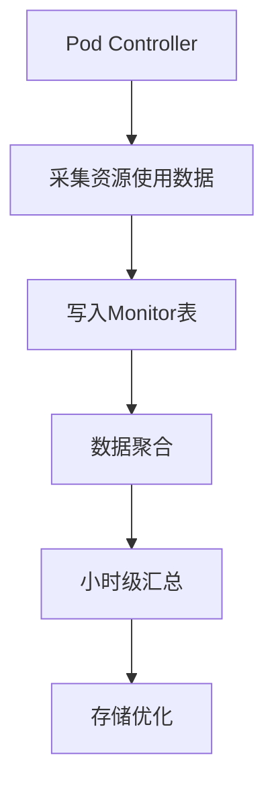
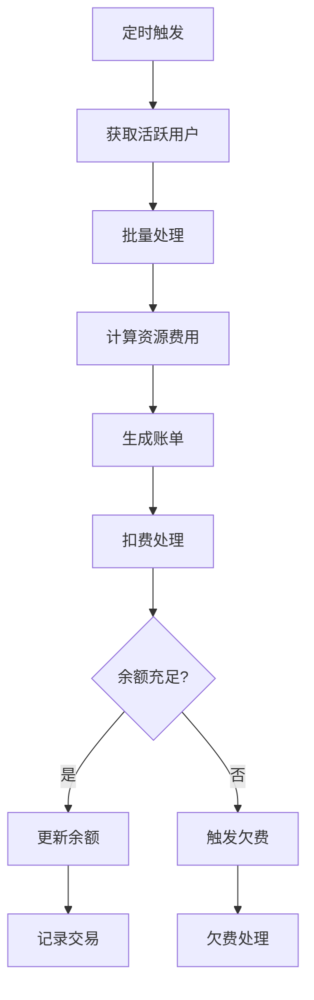
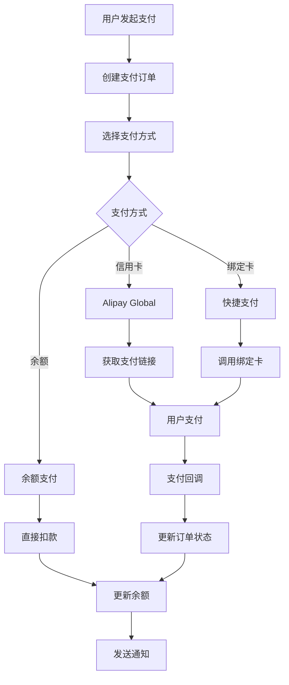
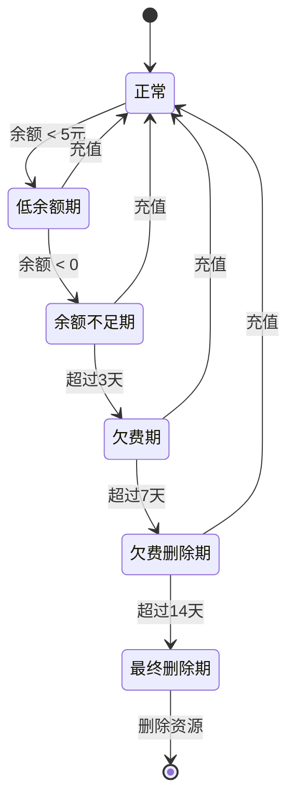

# Sealos 计费系统设计方案

## 目录
1. [系统概述](#系统概述)
2. [架构设计](#架构设计)
3. [核心组件](#核心组件)
4. [数据模型](#数据模型)
5. [计费流程](#计费流程)
6. [资源计量](#资源计量)
7. [支付系统](#支付系统)
8. [欠费管理](#欠费管理)
9. [系统特性](#系统特性)
10. [部署架构](#部署架构)

## 系统概述

Sealos计费系统是一个基于Kubernetes的云原生计费解决方案，专为多租户PaaS平台设计。系统通过Operator模式实现资源的自动化监控、计量和计费，支持按需付费和订阅付费模式。

### 主要功能
- **资源计量**：实时监控CPU、内存、存储、网络等资源使用情况
- **自动计费**：按小时自动生成账单，支持精确到1/1000000元的计费
- **账户管理**：用户余额管理，支持充值余额和抵扣余额
- **支付集成**：集成多种支付方式，支持自动续费
- **欠费控制**：多级欠费管理，自动限制和恢复资源

## 架构设计

### 系统架构图

```
┌─────────────────────────────────────────────────────────────────────┐
│                           用户界面层                                  │
│  ┌─────────────┐  ┌─────────────┐  ┌─────────────┐  ┌──────────┐  │
│  │   前端应用   │  │   API网关   │  │  管理控制台  │  │  监控面板 │  │
│  └─────────────┘  └─────────────┘  └─────────────┘  └──────────┘  │
└─────────────────────────────────────────────────────────────────────┘
                                    │
┌─────────────────────────────────────────────────────────────────────┐
│                           API服务层                                   │
│  ┌─────────────┐  ┌─────────────┐  ┌─────────────┐  ┌──────────┐  │
│  │ Account API │  │ Payment API │  │ Billing API │  │ Query API│  │
│  └─────────────┘  └─────────────┘  └─────────────┘  └──────────┘  │
└─────────────────────────────────────────────────────────────────────┘
                                    │
┌─────────────────────────────────────────────────────────────────────┐
│                         控制器层（Operators）                         │
│  ┌────────────┐  ┌────────────┐  ┌────────────┐  ┌─────────────┐  │
│  │  Account   │  │  Billing   │  │    Debt    │  │   Payment   │  │
│  │ Controller │  │ Controller │  │ Controller │  │ Controller  │  │
│  └────────────┘  └────────────┘  └────────────┘  └─────────────┘  │
│  ┌────────────┐  ┌────────────┐  ┌────────────┐  ┌─────────────┐  │
│  │    Pod     │  │  Monitor   │  │ Resources  │  │ Namespace   │  │
│  │ Controller │  │ Controller │  │ Controller │  │ Controller  │  │
│  └────────────┘  └────────────┘  └────────────┘  └─────────────┘  │
└─────────────────────────────────────────────────────────────────────┘
                                    │
┌─────────────────────────────────────────────────────────────────────┐
│                           数据访问层                                  │
│  ┌─────────────────────┐  ┌─────────────────┐  ┌────────────────┐  │
│  │   CockroachDB驱动   │  │   MongoDB驱动   │  │  Redis客户端   │  │
│  └─────────────────────┘  └─────────────────┘  └────────────────┘  │
└─────────────────────────────────────────────────────────────────────┘
                                    │
┌─────────────────────────────────────────────────────────────────────┐
│                           存储层                                      │
│  ┌─────────────────────┐  ┌─────────────────┐  ┌────────────────┐  │
│  │    CockroachDB      │  │     MongoDB     │  │     Redis      │  │
│  │  (账户/支付/订阅)   │  │  (监控/计费数据) │  │    (缓存)     │  │
│  └─────────────────────┘  └─────────────────┘  └────────────────┘  │
└─────────────────────────────────────────────────────────────────────┘
```

### 组件职责

| 组件 | 职责描述 |
|------|----------|
| Account Controller | 管理用户账户、余额更新、加密存储 |
| Billing Controller | 定时计费任务、账单生成、费用计算 |
| Debt Controller | 欠费监控、资源限制、恢复处理 |
| Payment Controller | 支付订单管理、支付状态同步 |
| Pod Controller | Pod资源监控、使用量采集 |
| Monitor Controller | 资源使用数据聚合、存储优化 |
| Resources Controller | 资源配额管理、网络控制 |
| Namespace Controller | 命名空间级别的资源管理 |

## 核心组件

### 1. 账户管理组件

#### Account Controller
- **功能**：管理用户账户的创建、更新和余额维护
- **特性**：
  - 支持余额加密存储
  - 实时余额更新
  - 活动赠送金额管理
  - 多币种支持（预留）

#### 账户结构
```go
type Account struct {
    UserUID          uuid.UUID  // 用户唯一标识
    Balance          int64      // 充值余额（单位：1/1000000元）
    DeductionBalance int64      // 抵扣余额
    ActivityBonus    int64      // 活动赠送（仅展示）
    EncryptBalance   string     // 加密余额
    UpdatedAt        time.Time  // 更新时间
}
```

### 2. 计费引擎

#### Billing Controller
- **执行周期**：每小时执行一次
- **处理能力**：
  - 批量处理：200个用户/批次
  - 并发数：10个并发任务
  - 重试机制：3次失败重试

#### 计费配置
```yaml
billingInterval: 60m        # 计费间隔
batchSize: 200             # 批次大小
concurrencyLimit: 10       # 并发限制
retryAttempts: 3           # 重试次数
enableCreditsDeduction: true # 启用积分抵扣
```

### 3. 资源监控

#### Monitor Controller
- **采集频率**：每分钟
- **聚合周期**：小时级
- **存储优化**：数据压缩和归档

#### 监控指标
- CPU使用率（millicore）
- 内存使用量（MiB）
- 存储容量（GiB）
- 网络流量（MiB）
- GPU使用（如配置）

## 数据模型

### 1. 核心实体

#### 账户相关
```go
// 用户账户
type Account struct {
    ID               int64
    UserUID          uuid.UUID
    ActivityBonus    int64
    EncryptBalance   string
    Balance          int64
    DeductionBalance int64
    CreatedAt        time.Time
    UpdatedAt        time.Time
}

// 账户交易记录
type AccountTransaction struct {
    ID        int64
    UserUID   uuid.UUID
    Balance   int64
    Type      TransactionType
    Namespace string
    Reason    string
    OrderID   string
    Time      time.Time
}
```

#### 计费相关
```go
// 计费记录
type Billing struct {
    ID        int64
    Time      time.Time
    OrderID   string
    Type      common.Type
    Namespace string
    AppType   uint8
    AppName   string
    Resources corev1.ResourceList
    Amount    int64
    Status    BillingStatus
}

// 资源监控数据
type Monitor struct {
    Time       time.Time
    Category   string    // namespace
    Type       uint8     // 应用类型
    Name       string    // 应用名称
    Used       map[uint8]int64 // 资源使用量
    Property   string    // 资源属性
}
```

#### 支付相关
```go
// 支付订单
type Payment struct {
    ID           int64
    UserUID      uuid.UUID
    Amount       int64
    Method       string
    TradeNO      string
    CodeURL      string
    Status       PaymentOrderStatus
    Type         PaymentType
    ChargeSource ChargeSource
    CreatedAt    time.Time
    UpdatedAt    time.Time
}
```

### 2. 资源定价

#### 默认价格表
| 资源类型 | 单价 | 单位 | 计价方式 |
|---------|------|------|---------|
| CPU | 0.067元 | 核·小时 | AVG |
| 内存 | 0.033元 | GiB·小时 | AVG |
| 存储 | 0.002元 | GiB·小时 | SUM |
| 网络流量 | 0.8元 | GiB | DIF |
| NodePort | 2.083元 | 个·小时 | SUM |
| GPU | 定制 | 卡·小时 | AVG |

#### 计价方式说明
- **AVG**：按平均使用量计费
- **SUM**：按累计使用量计费
- **DIF**：按使用量差值计费

## 计费流程

### 1. 资源采集流程


### 2. 计费处理流程


### 3. 扣费优先级
1. 优先使用积分（Credits）
2. 其次使用抵扣余额
3. 最后使用充值余额
4. 余额不足触发欠费流程

## 资源计量

### 1. 资源识别规则

#### 应用类型识别
```go
// 数据库
if pod.Labels["apps.kubeblocks.io/component-name"] != "" {
    return DB
}

// 应用
if pod.Labels["app"] != "" || 
   pod.Labels["cloud.sealos.io/app-deploy-manager"] != "" {
    return APP
}

// 终端
if pod.Labels["TerminalID"] != "" {
    return TERMINAL
}

// DevBox
if pod.Labels["app.kubernetes.io/part-of"] == "devbox" {
    return DEVBOX
}
```

### 2. 计量维度

#### CPU计量
- 单位：millicore（1核 = 1000 millicore）
- 采集：Pod的CPU使用率
- 计算：平均使用量 × 时长 × 单价

#### 内存计量
- 单位：MiB（1GiB = 1024MiB）
- 采集：Pod的内存使用量
- 计算：平均使用量 × 时长 × 单价

#### 存储计量
- 单位：GiB
- 采集：PVC的实际使用量
- 计算：累计使用量 × 时长 × 单价

#### 网络计量
- 单位：MiB
- 采集：Pod的网络流入/流出
- 计算：流量差值 × 单价

### 3. 特殊资源处理

#### GPU资源
- 通过nvidia-gpu标签识别
- 支持按卡计费
- 可配置不同型号价格

#### 对象存储
- 集成MinIO指标
- 支持存储容量和流量计费
- 按bucket统计使用量

## 支付系统

### 1. 支付流程


### 2. 支付方式

#### 已实现
- **Alipay Global**：国际信用卡支付
- **余额支付**：使用账户余额
- **绑定卡支付**：快捷支付

#### 规划中
- **微信支付**
- **PayPal**
- **加密货币**

### 3. 支付安全
- HTTPS加密传输
- 支付数据加密存储
- 支付回调签名验证
- 幂等性保证

## 欠费管理

### 1. 欠费状态机


### 2. 资源限制策略

| 状态 | 限制措施 | 恢复条件 |
|------|---------|---------|
| 低余额期 | 发送警告通知 | 充值到5元以上 |
| 余额不足期 | 限制创建新资源 | 余额转正 |
| 欠费期 | 暂停Pod调度 | 充值补齐欠费 |
| 欠费删除期 | 删除运行资源 | 充值补齐欠费 |
| 最终删除期 | 删除所有数据 | 不可恢复 |

### 3. 欠费恢复

#### 自动恢复流程
1. 检测到充值事件
2. 计算欠费金额
3. 扣除欠费（优先）
4. 更新账户状态
5. 恢复资源（如需要）
6. 发送恢复通知

#### 手动恢复
- 管理员可手动调整余额
- 支持欠费豁免
- 可延长删除期限

## 系统特性

### 1. 高可用性
- **分布式存储**：CockroachDB提供全局一致性
- **批量处理**：减少数据库压力
- **失败重试**：自动重试失败任务
- **健康检查**：定期检查系统状态

### 2. 性能优化
- **并发控制**：限制并发数防止过载
- **批量写入**：减少数据库操作次数
- **数据聚合**：小时级数据聚合减少存储
- **缓存机制**：Redis缓存热点数据

### 3. 可扩展性
- **插件式架构**：易于添加新资源类型
- **配置驱动**：通过配置调整计费规则
- **多区域支持**：支持跨区域部署
- **水平扩展**：控制器可多副本运行

### 4. 安全性
- **数据加密**：敏感数据加密存储
- **访问控制**：基于RBAC的权限管理
- **审计日志**：记录所有关键操作
- **防重放攻击**：支付接口防重放

### 5. 监控告警
- **Prometheus集成**：系统指标监控
- **自定义指标**：业务指标上报
- **告警规则**：余额不足、系统异常告警
- **日志收集**：结构化日志便于分析

## 部署架构

### 1. 推荐配置

#### 生产环境
```yaml
# Account Controller
replicas: 3
resources:
  requests:
    cpu: 500m
    memory: 512Mi
  limits:
    cpu: 2000m
    memory: 2Gi

# Billing Controller
replicas: 2
resources:
  requests:
    cpu: 1000m
    memory: 1Gi
  limits:
    cpu: 4000m
    memory: 4Gi

# Monitor Controller
replicas: 3
resources:
  requests:
    cpu: 2000m
    memory: 2Gi
  limits:
    cpu: 8000m
    memory: 8Gi
```

### 2. 数据库要求

#### CockroachDB
- 版本：≥ 21.2
- 节点数：≥ 3
- 存储：SSD推荐
- 网络：低延迟网络

#### MongoDB
- 版本：≥ 4.4
- 副本集：3节点
- 存储：≥ 500GB
- 内存：≥ 16GB

### 3. 依赖服务
- **Kubernetes**：≥ 1.24
- **Prometheus**：监控数据源
- **Redis**：缓存服务（可选）
- **消息队列**：异步处理（可选）

## 最佳实践

### 1. 部署建议
- 使用专用命名空间部署计费系统
- 配置资源限制防止资源耗尽
- 启用Pod反亲和性提高可用性
- 定期备份数据库

### 2. 性能调优
- 根据用户规模调整批次大小
- 监控数据库性能，及时扩容
- 使用SSD存储提高I/O性能
- 合理设置并发数

### 3. 运维管理
- 定期检查计费准确性
- 监控欠费用户比例
- 及时处理支付异常
- 保持价格配置更新

### 4. 安全加固
- 定期更新安全补丁
- 限制数据库访问权限
- 加密备份数据
- 审计关键操作

## 总结

Sealos计费系统是一个完整的云原生计费解决方案，具有以下特点：

1. **云原生设计**：基于Kubernetes Operator模式，充分利用云原生生态
2. **实时计量**：分钟级资源监控，小时级精确计费
3. **灵活计费**：支持多种资源类型和计费模式
4. **完整闭环**：从资源监控到支付、欠费管理的完整流程
5. **高可用性**：分布式架构，支持故障恢复
6. **易于扩展**：插件式设计，便于添加新功能

该系统已在生产环境稳定运行，支撑了大规模用户的计费需求，为Sealos平台的商业化运营提供了坚实的基础。