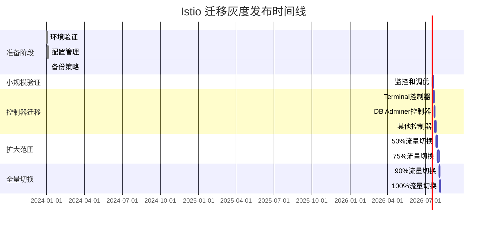

# Istio 迁移灰度发布策略

## 概述

本文档详细说明从 Kubernetes Ingress 到 Istio Gateway/VirtualService 的灰度发布策略，确保在迁移过程中系统的稳定性和可用性。

## 灰度发布原则

### 1. 渐进式切换
- 从低风险应用开始
- 按百分比逐步增加流量
- 保持快速回滚能力

### 2. 监控驱动
- 关键指标实时监控
- 自动化异常检测
- 基于数据的决策

### 3. 用户无感知
- 保持 API 兼容性
- 无服务中断
- 透明的流量切换

## 发布阶段

### Phase 5.1: 准备阶段（1周）

#### 5.1.1 环境验证
```bash
# 检查 Istio 安装状态
kubectl get pods -n istio-system
kubectl get svc -n istio-system

# 验证控制器双模式支持
kubectl get deployment -n sealos-system -l app.kubernetes.io/name=terminal-controller
kubectl get deployment -n sealos-system -l app.kubernetes.io/name=db-adminer-controller

# 检查前端应用版本
kubectl get configmap -n sealos-system -l app=sealos-frontend
```

#### 5.1.2 配置管理
- 创建配置中心用于切换控制
- 设置灰度发布参数
- 配置监控和告警系统

#### 5.1.3 备份策略
```bash
# 备份当前 Ingress 配置
kubectl get ingress --all-namespaces -o yaml > backup/ingress-backup-$(date +%Y%m%d).yaml

# 备份控制器配置
kubectl get deployment -n sealos-system -o yaml > backup/controllers-backup-$(date +%Y%m%d).yaml
```

### Phase 5.2: 小规模验证（3天）

#### 目标
- 5% 新用户使用 Istio
- 验证基本功能正常
- 收集初步性能数据

#### 执行步骤

1. **启用 Istio 模式**
```yaml
# 配置 Terminal 控制器
apiVersion: v1
kind: ConfigMap
metadata:
  name: terminal-controller-config
  namespace: sealos-system
data:
  networking_mode: "dual"  # dual, ingress, istio
  istio_percentage: "5"
  enable_istio_monitoring: "true"
```

2. **流量切换**
```bash
# 使用脚本自动切换新用户到 Istio
./scripts/gradual-rollout.sh --percentage 5 --component terminal
```

3. **监控验证**
- 请求成功率: ≥99.9%
- P95 延迟: 增加 ≤15%
- 错误率: ≤0.1%

#### 回滚条件
- 错误率超过 0.5%
- P95 延迟增加超过 25%
- 用户投诉增加

### Phase 5.3: 控制器逐步迁移（1周）

#### 5.3.1 Terminal 控制器（第1-2天）
```bash
# Day 1: 10% 流量
./scripts/gradual-rollout.sh --percentage 10 --component terminal

# Day 2: 25% 流量（如果监控正常）
./scripts/gradual-rollout.sh --percentage 25 --component terminal
```

#### 5.3.2 DB Adminer 控制器（第3-4天）
```bash
# Day 3: 启用 DB Adminer Istio 支持
./scripts/gradual-rollout.sh --percentage 10 --component db-adminer

# Day 4: 增加到 25%
./scripts/gradual-rollout.sh --percentage 25 --component db-adminer
```

#### 5.3.3 其他控制器（第5-7天）
- Resources 控制器
- Webhook 组件
- 前端应用

### Phase 5.4: 扩大范围（1周）

#### 目标
- 50% 流量切换到 Istio
- 验证高负载场景
- 收集完整性能数据

#### 执行计划
```bash
# 第1天: 40% 流量
./scripts/gradual-rollout.sh --percentage 40 --all-components

# 第3天: 50% 流量
./scripts/gradual-rollout.sh --percentage 50 --all-components

# 第5天: 75% 流量（如果一切正常）
./scripts/gradual-rollout.sh --percentage 75 --all-components
```

### Phase 5.5: 全量切换（3天）

#### 前置条件检查
- [ ] 所有监控指标正常
- [ ] 性能满足 SLA 要求
- [ ] 团队培训完成
- [ ] 应急响应流程就绪

#### 执行步骤
```bash
# Day 1: 90% 流量
./scripts/gradual-rollout.sh --percentage 90 --all-components

# Day 2: 95% 流量
./scripts/gradual-rollout.sh --percentage 95 --all-components

# Day 3: 100% 流量（全量切换）
./scripts/gradual-rollout.sh --percentage 100 --all-components
```

## 监控指标

### 关键业务指标
```yaml
# SLI (Service Level Indicators)
service_availability:
  target: 99.9%
  measurement: "成功请求数 / 总请求数"

response_latency_p95:
  target: "<= 150ms"
  measurement: "95% 请求的响应时间"

error_rate:
  target: "<= 0.1%"
  measurement: "错误请求数 / 总请求数"

throughput:
  target: ">= 当前基线的 95%"
  measurement: "每秒处理的请求数"
```

### 技术指标
```yaml
# 资源使用情况
cpu_usage:
  istio_proxy: "<= 200m per pod"
  control_plane: "<= 500m total"

memory_usage:
  istio_proxy: "<= 128Mi per pod"
  control_plane: "<= 1Gi total"

# 网络指标
connection_success_rate:
  target: ">= 99.9%"

ssl_handshake_time:
  target: "<= 100ms"
```

### 监控仪表板

#### Grafana 仪表板配置
```json
{
  "dashboard": {
    "title": "Istio Migration Monitoring",
    "panels": [
      {
        "title": "Traffic Split",
        "type": "stat",
        "targets": [
          "sum(rate(istio_requests_total[5m])) by (destination_app)"
        ]
      },
      {
        "title": "Success Rate",
        "type": "graph",
        "targets": [
          "rate(istio_requests_total{response_code!~'5.*'}[5m]) / rate(istio_requests_total[5m])"
        ]
      },
      {
        "title": "P95 Latency",
        "type": "graph", 
        "targets": [
          "histogram_quantile(0.95, rate(istio_request_duration_milliseconds_bucket[5m]))"
        ]
      }
    ]
  }
}
```

## 回滚策略

### 自动回滚条件
```yaml
auto_rollback_triggers:
  error_rate_threshold: 1.0%  # 错误率超过 1%
  latency_degradation: 50%    # 延迟增加超过 50%
  availability_drop: 99.0%    # 可用性低于 99%
  duration: 5m               # 持续时间
```

### 回滚执行
```bash
# 快速回滚到 Ingress 模式
./scripts/emergency-rollback.sh --mode ingress --percentage 0

# 部分回滚（保留部分 Istio 流量）
./scripts/emergency-rollback.sh --mode dual --percentage 10
```

### 回滚验证
1. 检查所有服务恢复正常
2. 验证用户访问无异常
3. 确认监控指标恢复
4. 通知相关团队

## 风险控制

### 风险识别
```yaml
technical_risks:
  - name: "性能降级"
    probability: "中"
    impact: "高"
    mitigation: "性能监控和自动回滚"
    
  - name: "配置错误"
    probability: "低"
    impact: "高"
    mitigation: "配置验证和测试"
    
  - name: "证书问题"
    probability: "低"
    impact: "中"
    mitigation: "证书监控和自动续期"

business_risks:
  - name: "用户体验影响"
    probability: "低"
    impact: "高"
    mitigation: "A/B 测试和用户反馈收集"
    
  - name: "服务中断"
    probability: "极低"
    impact: "极高"
    mitigation: "蓝绿部署和快速回滚"
```

### 应急预案
```bash
# 应急联系人
PRIMARY_ONCALL="sre-team@sealos.io"
SECONDARY_ONCALL="dev-team@sealos.io"

# 应急回滚流程
emergency_rollback() {
    echo "执行应急回滚..."
    ./scripts/emergency-rollback.sh --mode ingress
    
    # 通知团队
    send_alert "Istio migration emergency rollback executed"
    
    # 开始故障分析
    ./scripts/incident-response.sh --start
}
```

## 成功标准

### 技术指标
- [ ] 99.9% 服务可用性
- [ ] P95 延迟增加 ≤15%
- [ ] 错误率 ≤0.1%
- [ ] 资源使用增加 ≤20%

### 业务指标
- [ ] 用户投诉数量无明显增加
- [ ] 新功能正常部署和使用
- [ ] 开发团队生产力无影响

### 运维指标
- [ ] 监控系统完整覆盖
- [ ] 自动化部署流程稳定
- [ ] 团队技能满足运维要求

## 时间计划



## 总结

本灰度发布策略确保了 Istio 迁移的安全性和可控性，通过渐进式的流量切换、完善的监控体系和快速的回滚机制，最大程度地降低了迁移风险，保障了服务的稳定性和用户体验。