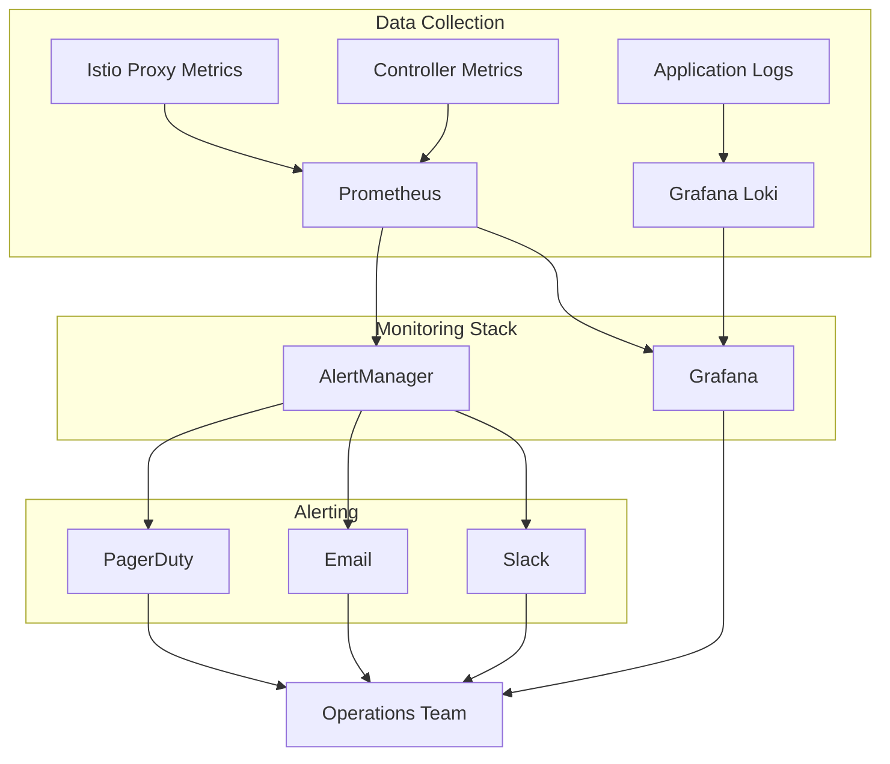

# Istio 迁移监控仪表板配置

## 概述

本文档详细描述了 Istio 迁移过程中的监控配置，包括关键指标、仪表板配置和告警规则。

## 监控架构



## 关键监控指标

### 1. 流量指标 (Traffic Metrics)

#### Istio 请求指标
```prometheus
# 请求成功率
sum(rate(istio_requests_total{response_code!~"5.*"}[5m])) by (destination_service_name) /
sum(rate(istio_requests_total[5m])) by (destination_service_name)

# 请求延迟 P95
histogram_quantile(0.95, 
  sum(rate(istio_request_duration_milliseconds_bucket[5m])) by (destination_service_name, le)
)

# 每秒请求数 (RPS)
sum(rate(istio_requests_total[5m])) by (destination_service_name)

# 错误率
sum(rate(istio_requests_total{response_code=~"5.*"}[5m])) by (destination_service_name) /
sum(rate(istio_requests_total[5m])) by (destination_service_name)
```

#### 流量分布指标
```prometheus
# Istio vs Ingress 流量分布
sum(rate(istio_requests_total[5m])) by (destination_service_name) /
(sum(rate(istio_requests_total[5m])) by (destination_service_name) + 
 sum(rate(nginx_ingress_controller_requests[5m])) by (service))

# 按协议分布
sum(rate(istio_requests_total[5m])) by (request_protocol)
```

### 2. 性能指标 (Performance Metrics)

#### 延迟指标
```prometheus
# P50 延迟
histogram_quantile(0.50, 
  sum(rate(istio_request_duration_milliseconds_bucket[5m])) by (destination_service_name, le)
)

# P90 延迟
histogram_quantile(0.90, 
  sum(rate(istio_request_duration_milliseconds_bucket[5m])) by (destination_service_name, le)
)

# P99 延迟
histogram_quantile(0.99, 
  sum(rate(istio_request_duration_milliseconds_bucket[5m])) by (destination_service_name, le)
)
```

#### 吞吐量指标
```prometheus
# 总吞吐量
sum(rate(istio_requests_total[5m]))

# 按服务吞吐量
sum(rate(istio_requests_total[5m])) by (destination_service_name)

# 峰值吞吐量 (1分钟)
max_over_time(sum(rate(istio_requests_total[1m]))[5m:])
```

### 3. 资源使用指标 (Resource Metrics)

#### CPU 使用率
```prometheus
# Istio Proxy CPU 使用率
sum(rate(container_cpu_usage_seconds_total{container="istio-proxy"}[5m])) by (pod)

# 控制平面 CPU 使用率
sum(rate(container_cpu_usage_seconds_total{namespace="istio-system"}[5m])) by (pod)
```

#### 内存使用率
```prometheus
# Istio Proxy 内存使用
sum(container_memory_working_set_bytes{container="istio-proxy"}) by (pod)

# 控制平面内存使用
sum(container_memory_working_set_bytes{namespace="istio-system"}) by (pod)
```

### 4. 健康指标 (Health Metrics)

#### 服务健康度
```prometheus
# Pod 就绪状态
kube_pod_status_ready{namespace="sealos-system"}

# 部署状态
kube_deployment_status_replicas_available{namespace="sealos-system"} /
kube_deployment_spec_replicas{namespace="sealos-system"}
```

#### 网络健康度
```prometheus
# TCP 连接成功率
sum(rate(istio_tcp_opened_total[5m])) /
sum(rate(istio_tcp_connections_opened_total[5m]))

# TLS 握手成功率
sum(rate(istio_request_total{response_flags!~".*TLS.*"}[5m])) /
sum(rate(istio_request_total[5m]))
```

## Grafana 仪表板配置

### 主仪表板 - Istio Migration Overview

```json
{
  "dashboard": {
    "id": null,
    "title": "Istio Migration Overview",
    "tags": ["istio", "migration", "sealos"],
    "timezone": "browser",
    "refresh": "30s",
    "time": {
      "from": "now-1h",
      "to": "now"
    },
    "panels": [
      {
        "id": 1,
        "title": "Traffic Split (Istio vs Ingress)",
        "type": "piechart",
        "targets": [
          {
            "expr": "sum(rate(istio_requests_total[5m]))",
            "legendFormat": "Istio"
          },
          {
            "expr": "sum(rate(nginx_ingress_controller_requests[5m]))",
            "legendFormat": "Ingress"
          }
        ],
        "gridPos": {"h": 8, "w": 12, "x": 0, "y": 0}
      },
      {
        "id": 2,
        "title": "Request Success Rate",
        "type": "stat",
        "targets": [
          {
            "expr": "sum(rate(istio_requests_total{response_code!~'5.*'}[5m])) / sum(rate(istio_requests_total[5m]))",
            "legendFormat": "Success Rate"
          }
        ],
        "fieldConfig": {
          "defaults": {
            "unit": "percentunit",
            "thresholds": {
              "steps": [
                {"color": "red", "value": 0},
                {"color": "yellow", "value": 0.95},
                {"color": "green", "value": 0.99}
              ]
            }
          }
        },
        "gridPos": {"h": 8, "w": 12, "x": 12, "y": 0}
      },
      {
        "id": 3,
        "title": "Request Latency (P95)",
        "type": "timeseries",
        "targets": [
          {
            "expr": "histogram_quantile(0.95, sum(rate(istio_request_duration_milliseconds_bucket[5m])) by (destination_service_name, le))",
            "legendFormat": "{{destination_service_name}}"
          }
        ],
        "fieldConfig": {
          "defaults": {
            "unit": "ms",
            "thresholds": {
              "steps": [
                {"color": "green", "value": 0},
                {"color": "yellow", "value": 100},
                {"color": "red", "value": 200}
              ]
            }
          }
        },
        "gridPos": {"h": 8, "w": 24, "x": 0, "y": 8}
      },
      {
        "id": 4,
        "title": "Request Rate by Service",
        "type": "timeseries",
        "targets": [
          {
            "expr": "sum(rate(istio_requests_total[5m])) by (destination_service_name)",
            "legendFormat": "{{destination_service_name}}"
          }
        ],
        "fieldConfig": {
          "defaults": {
            "unit": "reqps"
          }
        },
        "gridPos": {"h": 8, "w": 12, "x": 0, "y": 16}
      },
      {
        "id": 5,
        "title": "Error Rate by Service",
        "type": "timeseries",
        "targets": [
          {
            "expr": "sum(rate(istio_requests_total{response_code=~'5.*'}[5m])) by (destination_service_name) / sum(rate(istio_requests_total[5m])) by (destination_service_name)",
            "legendFormat": "{{destination_service_name}}"
          }
        ],
        "fieldConfig": {
          "defaults": {
            "unit": "percentunit",
            "thresholds": {
              "steps": [
                {"color": "green", "value": 0},
                {"color": "yellow", "value": 0.01},
                {"color": "red", "value": 0.05}
              ]
            }
          }
        },
        "gridPos": {"h": 8, "w": 12, "x": 12, "y": 16}
      }
    ]
  }
}
```

### 性能仪表板 - Performance Monitoring

```json
{
  "dashboard": {
    "title": "Istio Migration - Performance",
    "panels": [
      {
        "id": 1,
        "title": "Latency Percentiles",
        "type": "timeseries",
        "targets": [
          {
            "expr": "histogram_quantile(0.50, sum(rate(istio_request_duration_milliseconds_bucket[5m])) by (le))",
            "legendFormat": "P50"
          },
          {
            "expr": "histogram_quantile(0.90, sum(rate(istio_request_duration_milliseconds_bucket[5m])) by (le))",
            "legendFormat": "P90"
          },
          {
            "expr": "histogram_quantile(0.95, sum(rate(istio_request_duration_milliseconds_bucket[5m])) by (le))",
            "legendFormat": "P95"
          },
          {
            "expr": "histogram_quantile(0.99, sum(rate(istio_request_duration_milliseconds_bucket[5m])) by (le))",
            "legendFormat": "P99"
          }
        ]
      },
      {
        "id": 2,
        "title": "Resource Usage - CPU",
        "type": "timeseries",
        "targets": [
          {
            "expr": "sum(rate(container_cpu_usage_seconds_total{container='istio-proxy'}[5m])) by (pod)",
            "legendFormat": "{{pod}} (proxy)"
          },
          {
            "expr": "sum(rate(container_cpu_usage_seconds_total{namespace='istio-system'}[5m])) by (pod)",
            "legendFormat": "{{pod}} (control-plane)"
          }
        ]
      },
      {
        "id": 3,
        "title": "Resource Usage - Memory",
        "type": "timeseries",
        "targets": [
          {
            "expr": "sum(container_memory_working_set_bytes{container='istio-proxy'}) by (pod)",
            "legendFormat": "{{pod}} (proxy)"
          },
          {
            "expr": "sum(container_memory_working_set_bytes{namespace='istio-system'}) by (pod)",
            "legendFormat": "{{pod}} (control-plane)"
          }
        ]
      }
    ]
  }
}
```

### 组件仪表板 - Component Health

```json
{
  "dashboard": {
    "title": "Istio Migration - Component Health",
    "panels": [
      {
        "id": 1,
        "title": "Controller Status",
        "type": "table",
        "targets": [
          {
            "expr": "kube_deployment_status_replicas_available{namespace='sealos-system'} / kube_deployment_spec_replicas{namespace='sealos-system'}",
            "format": "table",
            "instant": true
          }
        ],
        "transformations": [
          {
            "id": "organize",
            "options": {
              "columns": [
                {"displayName": "Component", "path": "deployment"},
                {"displayName": "Ready %", "path": "Value"}
              ]
            }
          }
        ]
      },
      {
        "id": 2,
        "title": "Network Configuration Status",
        "type": "stat",
        "targets": [
          {
            "expr": "count(kube_deployment_labels{label_networking_mode='dual'})",
            "legendFormat": "Dual Mode"
          },
          {
            "expr": "count(kube_deployment_labels{label_networking_mode='istio'})",
            "legendFormat": "Istio Mode"
          },
          {
            "expr": "count(kube_deployment_labels{label_networking_mode='ingress'})",
            "legendFormat": "Ingress Mode"
          }
        ]
      }
    ]
  }
}
```

## AlertManager 告警规则

### 告警规则配置

```yaml
# istio-migration-alerts.yml
groups:
- name: istio-migration
  rules:
  # 高错误率告警
  - alert: IstioHighErrorRate
    expr: |
      sum(rate(istio_requests_total{response_code=~"5.*"}[5m])) by (destination_service_name) /
      sum(rate(istio_requests_total[5m])) by (destination_service_name) > 0.05
    for: 2m
    labels:
      severity: critical
      component: istio-migration
    annotations:
      summary: "High error rate detected in Istio service"
      description: "Service {{ $labels.destination_service_name }} has error rate of {{ $value | humanizePercentage }} for more than 2 minutes"

  # 高延迟告警
  - alert: IstioHighLatency
    expr: |
      histogram_quantile(0.95, 
        sum(rate(istio_request_duration_milliseconds_bucket[5m])) by (destination_service_name, le)
      ) > 500
    for: 3m
    labels:
      severity: warning
      component: istio-migration
    annotations:
      summary: "High latency detected in Istio service"
      description: "Service {{ $labels.destination_service_name }} P95 latency is {{ $value }}ms for more than 3 minutes"

  # 流量丢失告警
  - alert: IstioTrafficDrop
    expr: |
      (
        sum(rate(istio_requests_total[5m])) by (destination_service_name) + 
        sum(rate(nginx_ingress_controller_requests[5m])) by (service)
      ) / 
      sum(rate(istio_requests_total[5m]) offset 1h) by (destination_service_name) < 0.8
    for: 1m
    labels:
      severity: critical
      component: istio-migration
    annotations:
      summary: "Significant traffic drop detected"
      description: "Total traffic for {{ $labels.destination_service_name }} dropped by {{ $value | humanizePercentage }} compared to 1 hour ago"

  # 控制器不健康
  - alert: ControllerUnhealthy
    expr: |
      kube_deployment_status_replicas_available{namespace="sealos-system"} /
      kube_deployment_spec_replicas{namespace="sealos-system"} < 1
    for: 5m
    labels:
      severity: warning
      component: controller
    annotations:
      summary: "Controller deployment not fully available"
      description: "Deployment {{ $labels.deployment }} in namespace {{ $labels.namespace }} has {{ $value | humanizePercentage }} of desired replicas available"

  # Istio 控制平面问题
  - alert: IstioControlPlaneDown
    expr: |
      up{job="istio-pilot"} == 0
    for: 1m
    labels:
      severity: critical
      component: istio-control-plane
    annotations:
      summary: "Istio control plane is down"
      description: "Istio pilot/istiod is not responding"

  # 资源使用过高
  - alert: IstioProxyHighCPU
    expr: |
      sum(rate(container_cpu_usage_seconds_total{container="istio-proxy"}[5m])) by (pod) > 0.8
    for: 5m
    labels:
      severity: warning
      component: istio-proxy
    annotations:
      summary: "Istio proxy high CPU usage"
      description: "Pod {{ $labels.pod }} istio-proxy CPU usage is {{ $value | humanizePercentage }}"

  - alert: IstioProxyHighMemory
    expr: |
      container_memory_working_set_bytes{container="istio-proxy"} / 
      container_spec_memory_limit_bytes{container="istio-proxy"} > 0.9
    for: 5m
    labels:
      severity: warning
      component: istio-proxy
    annotations:
      summary: "Istio proxy high memory usage"
      description: "Pod {{ $labels.pod }} istio-proxy memory usage is {{ $value | humanizePercentage }}"
```

### 告警通知配置

```yaml
# alertmanager.yml
global:
  smtp_smarthost: 'smtp.company.com:587'
  smtp_from: 'alerts@sealos.io'

route:
  group_by: ['alertname', 'component']
  group_wait: 30s
  group_interval: 5m
  repeat_interval: 12h
  receiver: 'default'
  routes:
  - match:
      severity: critical
    receiver: 'critical-alerts'
  - match:
      component: istio-migration
    receiver: 'migration-team'

receivers:
- name: 'default'
  email_configs:
  - to: 'sre-team@sealos.io'
    subject: '[SEALOS] {{ .GroupLabels.alertname }}'
    body: |
      {{ range .Alerts }}
      Alert: {{ .Annotations.summary }}
      Description: {{ .Annotations.description }}
      {{ end }}

- name: 'critical-alerts'
  email_configs:
  - to: 'sre-team@sealos.io,dev-team@sealos.io'
    subject: '[CRITICAL] Sealos Istio Migration Alert'
  slack_configs:
  - api_url: 'YOUR_SLACK_WEBHOOK_URL'
    channel: '#sealos-alerts'
    color: 'danger'
    title: 'Critical Alert - Istio Migration'
    text: |
      {{ range .Alerts }}
      *Alert:* {{ .Annotations.summary }}
      *Description:* {{ .Annotations.description }}
      *Service:* {{ .Labels.destination_service_name }}
      {{ end }}

- name: 'migration-team'
  slack_configs:
  - api_url: 'YOUR_SLACK_WEBHOOK_URL'
    channel: '#istio-migration'
    color: 'warning'
    title: 'Istio Migration Alert'
```

## 监控脚本

### 自动化监控检查脚本

```bash
#!/bin/bash
# monitoring-check.sh - 自动化监控状态检查

PROMETHEUS_URL="http://prometheus.monitoring.svc.cluster.local:9090"
ALERT_THRESHOLD_ERROR_RATE=0.05
ALERT_THRESHOLD_LATENCY_P95=500

check_error_rate() {
    local query="sum(rate(istio_requests_total{response_code=~'5.*'}[5m])) / sum(rate(istio_requests_total[5m]))"
    local result=$(curl -s "${PROMETHEUS_URL}/api/v1/query?query=${query}" | jq -r '.data.result[0].value[1]')
    
    if (( $(echo "$result > $ALERT_THRESHOLD_ERROR_RATE" | bc -l) )); then
        echo "ALERT: Error rate ${result} exceeds threshold ${ALERT_THRESHOLD_ERROR_RATE}"
        return 1
    fi
    
    echo "OK: Error rate ${result} within threshold"
    return 0
}

check_latency() {
    local query="histogram_quantile(0.95, sum(rate(istio_request_duration_milliseconds_bucket[5m])) by (le))"
    local result=$(curl -s "${PROMETHEUS_URL}/api/v1/query?query=${query}" | jq -r '.data.result[0].value[1]')
    
    if (( $(echo "$result > $ALERT_THRESHOLD_LATENCY_P95" | bc -l) )); then
        echo "ALERT: P95 latency ${result}ms exceeds threshold ${ALERT_THRESHOLD_LATENCY_P95}ms"
        return 1
    fi
    
    echo "OK: P95 latency ${result}ms within threshold"
    return 0
}

main() {
    echo "Running Istio migration monitoring checks..."
    
    check_error_rate
    check_latency
    
    echo "Monitoring checks completed"
}

main "$@"
```

## 使用指南

### 1. 部署监控栈

```bash
# 安装 Prometheus Operator
kubectl apply -f https://raw.githubusercontent.com/prometheus-operator/prometheus-operator/main/bundle.yaml

# 部署 Grafana
helm install grafana grafana/grafana -n monitoring --create-namespace

# 导入仪表板
kubectl create configmap istio-migration-dashboard --from-file=dashboard.json -n monitoring
```

### 2. 配置告警

```bash
# 应用告警规则
kubectl apply -f istio-migration-alerts.yml

# 配置 AlertManager
kubectl apply -f alertmanager-config.yml
```

### 3. 访问仪表板

```bash
# 获取 Grafana 管理员密码
kubectl get secret grafana -n monitoring -o jsonpath="{.data.admin-password}" | base64 --decode

# 端口转发访问
kubectl port-forward svc/grafana 3000:80 -n monitoring
```

## 总结

本监控配置提供了完整的 Istio 迁移过程监控能力，包括：

- 实时流量监控和性能指标
- 自动化告警和通知
- 可视化仪表板
- 健康检查脚本

通过这套监控体系，可以确保迁移过程中的系统稳定性和问题的快速发现与响应。