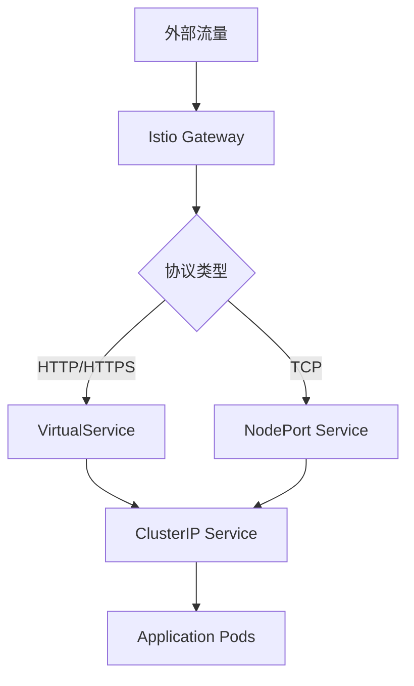

# LoadBalancer 限制影响分析与解决方案

## 问题描述

在 Istio 迁移环境设置文档 `1.1-environment-setup.md` 中，通过 ResourceQuota 禁止租户创建 LoadBalancer 服务：

```yaml
services.loadbalancers: "0"  # 禁止租户创建 LoadBalancer
```

本文档分析这一限制对现有 Sealos 功能的影响，并提供相应的解决方案。

## 影响分析

### 1. 代码搜索结果总结

通过全面搜索 Sealos 代码库，发现以下 LoadBalancer 使用模式：

#### 1.1 实际使用 LoadBalancer 的组件

**🚨 唯一影响：MinIO 对象存储服务**

```yaml
# /deploy/objectstorage/manifests/minio/deploy.yaml.tmpl
apiVersion: v1
kind: Service
metadata:
  name: object-storage
  namespace: objectstorage-system
spec:
  type: LoadBalancer  # ⚠️ 唯一使用 LoadBalancer 的服务
  ports:
    - name: http-minio
      protocol: TCP
      port: 80
      targetPort: 9000
```

#### 1.2 不受影响的组件

**✅ DevBox 服务 - 使用 NodePort + Istio**

```go
// controllers/devbox/internal/controller/devbox_controller.go
expectServiceSpec := corev1.ServiceSpec{
    Type:     corev1.ServiceTypeNodePort,  // 使用 NodePort，不是 LoadBalancer
    Ports:    servicePorts,
}
```

**✅ 数据库服务 - 使用 NodePort**

```typescript
// frontend/providers/dbprovider/src/utils/json2Yaml.ts
const template = {
  spec: {
    type: 'NodePort',  // 数据库使用 NodePort 暴露端口
    ports: [...]
  }
};
```

**✅ 用户应用 - 使用 NodePort + Istio Gateway**

```typescript
// frontend/providers/applaunchpad/src/utils/deployYaml2Json.ts
const templateNodePort = {
  spec: {
    type: 'NodePort',  // 用户应用使用 NodePort 进行 TCP 访问
    ports: openPublicPorts,
  }
};
```

### 2. 详细影响评估

| 组件类型 | 当前实现 | LoadBalancer 限制影响 | 影响级别 |
|----------|----------|----------------------|----------|
| **DevBox** | NodePort + Istio Gateway | ✅ 无影响 | 低 |
| **数据库服务** | NodePort 直连 | ✅ 无影响 | 低 |
| **用户应用 TCP** | NodePort + ClusterIP | ✅ 无影响 | 低 |
| **用户应用 HTTP** | Istio Gateway/VirtualService | ✅ 无影响 | 低 |
| **MinIO 对象存储** | LoadBalancer | 🚨 **受影响** | **高** |

### 3. 具体功能影响分析

#### 3.1 ✅ DevBox 端口暴露 - 无影响

**当前架构：**
- **SSH/远程连接**：通过 NodePort 服务暴露
- **Web 服务**：通过 Istio Gateway + VirtualService 暴露
- **网络模式**：支持 NodePort 和 Tailnet 两种模式

**验证代码：**
```go
// DevBox 网络类型定义
const (
    NetworkTypeNodePort NetworkType = "NodePort"  // 默认网络类型
    NetworkTypeTailnet  NetworkType = "Tailnet"   // VPN 网络类型
)
```

#### 3.2 ✅ 用户自定义应用 TCP 端口 - 无影响

**当前架构：**
- **内部通信**：ClusterIP 服务
- **TCP 端口暴露**：NodePort 服务 (`openNodePort: true`)
- **HTTP/HTTPS 暴露**：Istio Gateway (`openPublicDomain: true`)

**验证代码：**
```typescript
// 用户应用支持两种暴露方式
if (item.openNodePort) {
    // 创建 NodePort 服务用于 TCP 访问
    createNodePortService(item);
}
if (item.openPublicDomain) {
    // 创建 Istio Gateway 用于 HTTP 访问
    createIstioGateway(item);
}
```

#### 3.3 ✅ 数据库外部访问 - 无影响

**当前架构：**
- **直接 TCP 连接**：通过 NodePort 服务
- **端口映射**：每个数据库类型有固定端口映射
- **KubeBlocks 集成**：通过标签选择器关联

**验证代码：**
```typescript
// 数据库端口映射
const portsMap = {
  postgresql: 5432,
  mysql: 3306,
  mongodb: 27017,
  redis: 6379
};

// 创建 NodePort 服务
spec: {
  type: 'NodePort',
  ports: [{ port: portsMap[dbType] }]
}
```

#### 3.4 🚨 MinIO 对象存储 - 受影响

**当前架构：**
```yaml
# MinIO 服务配置
spec:
  type: LoadBalancer  # 问题所在
  ports:
    - port: 80
      targetPort: 9000
```

**影响范围：**
- 对象存储 API 访问可能受限
- 文件上传/下载功能可能不可用
- 依赖对象存储的应用功能受影响

## 解决方案

### 方案一：修改 MinIO 服务类型（推荐）

#### 1.1 将 MinIO 改为 NodePort + Istio Gateway

**修改部署配置：**

```yaml
# 新的 MinIO Service 配置
apiVersion: v1
kind: Service
metadata:
  name: object-storage
  namespace: objectstorage-system
spec:
  type: NodePort  # 改为 NodePort
  ports:
    - name: http-minio
      protocol: TCP
      port: 9000
      targetPort: 9000
      nodePort: 30900  # 固定 NodePort
  selector:
    v1.min.io/tenant: object-storage
```

**添加 Istio Gateway：**

```yaml
# MinIO Istio Gateway
apiVersion: networking.istio.io/v1beta1
kind: Gateway
metadata:
  name: minio-gateway
  namespace: objectstorage-system
spec:
  selector:
    istio: ingressgateway
  servers:
  - port:
      number: 80
      name: http
      protocol: HTTP
    hosts:
    - "minio.objectstorage-system.sealos.io"
    - "*.objectstorage-system.sealos.io"
  - port:
      number: 443
      name: https
      protocol: HTTPS
    hosts:
    - "minio.objectstorage-system.sealos.io"
    - "*.objectstorage-system.sealos.io"
    tls:
      mode: SIMPLE
      credentialName: objectstorage-tls-cert
---
apiVersion: networking.istio.io/v1beta1
kind: VirtualService
metadata:
  name: minio-vs
  namespace: objectstorage-system
spec:
  hosts:
  - "minio.objectstorage-system.sealos.io"
  gateways:
  - minio-gateway
  http:
  - match:
    - uri:
        prefix: /
    route:
    - destination:
        host: object-storage
        port:
          number: 9000
    timeout: 300s
    corsPolicy:
      allowOrigins:
      - regex: ".*"
      allowMethods:
      - GET
      - POST
      - PUT
      - DELETE
      - HEAD
      - OPTIONS
      allowHeaders:
      - "*"
```

#### 1.2 更新 MinIO 客户端配置

**前端配置更新：**

```typescript
// 更新 MinIO 客户端端点配置
const minioConfig = {
  endPoint: process.env.NODE_ENV === 'development' 
    ? 'localhost:30900'  // 开发环境使用 NodePort
    : 'minio.objectstorage-system.sealos.io',  // 生产环境使用 Istio Gateway
  port: process.env.NODE_ENV === 'development' ? 30900 : 443,
  useSSL: process.env.NODE_ENV !== 'development',
  accessKey: process.env.MINIO_ACCESS_KEY,
  secretKey: process.env.MINIO_SECRET_KEY
};
```

### 方案二：例外处理 MinIO（备选）

#### 2.1 为 objectstorage-system 命名空间创建例外

**修改租户命名空间脚本：**

```bash
# create-tenant-namespace.sh
# 只对用户命名空间应用 LoadBalancer 限制
if [[ "$NAMESPACE" != "objectstorage-system" ]]; then
cat <<EOF | kubectl apply -f -
apiVersion: v1
kind: ResourceQuota
metadata:
  name: ${TENANT_NAME}-quota
  namespace: $NAMESPACE
spec:
  hard:
    services.loadbalancers: "0"  # 只对非系统命名空间限制
EOF
fi
```

#### 2.2 使用 NetworkPolicy 隔离

```yaml
# MinIO 网络隔离策略
apiVersion: networking.k8s.io/v1
kind: NetworkPolicy
metadata:
  name: minio-isolation
  namespace: objectstorage-system
spec:
  podSelector:
    matchLabels:
      v1.min.io/tenant: object-storage
  policyTypes:
  - Ingress
  - Egress
  ingress:
  - from:
    - namespaceSelector:
        matchLabels:
          name: istio-system
  - from:
    - namespaceSelector:
        matchLabels:
          name: sealos-system
  egress:
  - to: []  # 允许所有出站流量
```

### 方案三：全面迁移到 Istio（长期方案）

#### 3.1 统一网络架构

**设计原则：**
- 所有外部访问通过 Istio Gateway
- 内部服务使用 ClusterIP
- 需要直接 TCP 访问的使用 NodePort
- 完全移除 LoadBalancer 依赖

**实施步骤：**



## 迁移实施计划

### Phase 1: 立即修复 (1天)

1. **修改 MinIO 部署配置**
   ```bash
   # 更新 MinIO 服务类型
   kubectl patch service object-storage -n objectstorage-system -p '{"spec":{"type":"NodePort"}}'
   
   # 创建 Istio Gateway 和 VirtualService
   kubectl apply -f minio-istio-config.yaml
   ```

2. **验证功能正常**
   ```bash
   # 测试 MinIO API 访问
   curl -I http://minio.objectstorage-system.sealos.io/minio/health/live
   
   # 测试文件上传下载
   mc config host add sealos http://minio.objectstorage-system.sealos.io ACCESS_KEY SECRET_KEY
   mc ls sealos
   ```

### Phase 2: 验证和优化 (2天)

1. **全面功能测试**
   - DevBox SSH 连接测试
   - 数据库外部连接测试
   - 用户应用 TCP 端口测试
   - MinIO 对象存储测试

2. **性能对比测试**
   ```bash
   # 对比 LoadBalancer vs NodePort+Istio 性能
   ./scripts/performance-test.sh --component minio
   ```

### Phase 3: 文档更新 (1天)

1. **更新部署文档**
2. **更新故障排查指南**
3. **更新用户使用文档**

## 验证脚本

### 完整功能验证脚本

```bash
#!/bin/bash
# verify-no-loadbalancer.sh

echo "=== 验证 LoadBalancer 限制对 Sealos 功能的影响 ==="

# 1. 验证 DevBox 功能
echo "1. 测试 DevBox SSH 连接..."
kubectl get svc -n ns-testuser | grep NodePort
if [ $? -eq 0 ]; then
    echo "✅ DevBox NodePort 服务正常"
else
    echo "❌ DevBox 服务异常"
fi

# 2. 验证数据库连接
echo "2. 测试数据库外部连接..."
kubectl get svc -l app.kubernetes.io/managed-by=kubeblocks --all-namespaces
if [ $? -eq 0 ]; then
    echo "✅ 数据库 NodePort 服务正常"
else
    echo "❌ 数据库服务异常"
fi

# 3. 验证用户应用 TCP 端口
echo "3. 测试用户应用 TCP 端口..."
kubectl get svc --all-namespaces | grep nodeport
if [ $? -eq 0 ]; then
    echo "✅ 用户应用 NodePort 服务正常"
else
    echo "❌ 用户应用端口暴露异常"
fi

# 4. 验证 MinIO 访问
echo "4. 测试 MinIO 对象存储..."
kubectl get svc object-storage -n objectstorage-system
MINIO_TYPE=$(kubectl get svc object-storage -n objectstorage-system -o jsonpath='{.spec.type}')
if [ "$MINIO_TYPE" = "NodePort" ]; then
    echo "✅ MinIO 已迁移到 NodePort"
elif [ "$MINIO_TYPE" = "LoadBalancer" ]; then
    echo "⚠️  MinIO 仍使用 LoadBalancer，需要迁移"
fi

# 5. 检查 Istio Gateway
echo "5. 检查 Istio Gateway 配置..."
kubectl get gateway --all-namespaces | grep -v "No resources"
if [ $? -eq 0 ]; then
    echo "✅ Istio Gateway 配置正常"
else
    echo "❌ Istio Gateway 配置缺失"
fi

echo "=== 验证完成 ==="
```

## 总结

**关键发现：**
1. **影响范围有限**：只有 MinIO 对象存储使用 LoadBalancer
2. **现有架构适配**：DevBox、数据库、用户应用都已使用 NodePort + Istio
3. **解决方案简单**：只需将 MinIO 迁移到 NodePort + Istio Gateway

**推荐方案：**
- 采用 **方案一**：修改 MinIO 为 NodePort + Istio Gateway
- 保持现有架构的一致性
- 完全消除 LoadBalancer 依赖
- 提供更好的可观测性和安全性

**风险评估：**
- **低风险**：只涉及一个组件的修改
- **向前兼容**：不影响现有 API 接口
- **易于回滚**：可快速恢复到 LoadBalancer 模式

这个解决方案确保了 Istio 迁移过程中所有 Sealos 功能的正常运行，同时保持了架构的一致性和简洁性。