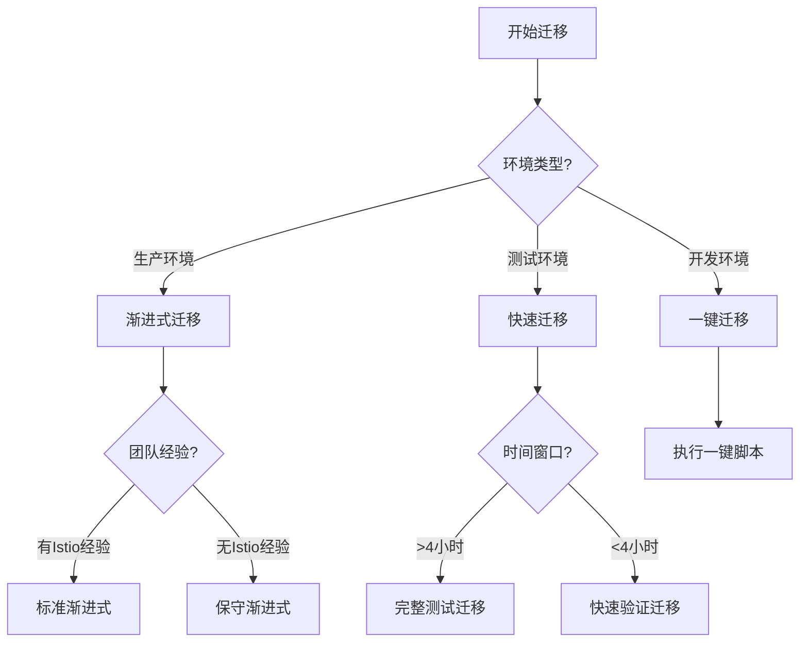

# Istio 迁移决策指南

## 🎯 选择适合您的迁移路径



## 📋 迁移方案对比

| 方案 | 适用场景 | 耗时 | 风险等级 | 回滚难度 |
|------|---------|------|----------|----------|
| **一键迁移** | 开发/测试环境 | 1小时 | 高 | 中 |
| **快速迁移** | 小规模生产 | 2-3小时 | 中 | 低 |
| **标准渐进式** | 中型生产环境 | 1-2天 | 低 | 很低 |
| **保守渐进式** | 大型关键系统 | 3-5天 | 很低 | 很低 |

## 🚀 方案一：一键迁移（开发/测试环境）

### 适用条件
- ✅ 非生产环境
- ✅ 可接受短暂服务中断
- ✅ 快速验证功能
- ✅ 服务数量 < 50

### 执行步骤
```bash
# 下载并执行一键迁移脚本
curl -sSL https://raw.githubusercontent.com/labring/sealos/main/scripts/istio-migration/quick-migrate.sh | bash

# 或者使用本地脚本
./scripts/istio-migration/one-click-migration.sh
```

### 时间规划
- 备份: 5分钟
- Istio安装: 10分钟
- 资源迁移: 30分钟
- 验证: 15分钟
- **总计: 约1小时**

## 🏃 方案二：快速迁移（小规模生产）

### 适用条件
- ✅ 小规模生产环境（< 100 服务）
- ✅ 有4小时维护窗口
- ✅ 团队有基础k8s经验
- ✅ 业务允许灰度切换

### 执行步骤
1. **准备阶段（30分钟）**
   ```bash
   # 使用快速检查清单
   ./scripts/istio-migration/pre-check.sh
   
   # 创建备份
   ./scripts/istio-migration/backup-all.sh
   ```

2. **执行阶段（2小时）**
   ```bash
   # 按照快速迁移清单执行
   ./scripts/istio-migration/phase6-full-cutover.sh --step all
   ```

3. **验证阶段（30分钟）**
   ```bash
   # 运行快速验证
   ./tests/istio-migration/quick-validation.sh
   ```

### 关键检查点
- [ ] Istio 组件全部就绪
- [ ] 50% 流量切换成功
- [ ] 关键服务验证通过
- [ ] 监控指标正常

## 🎯 方案三：标准渐进式（中型生产）

### 适用条件
- ✅ 中型生产环境（100-500 服务）
- ✅ 需要零停机迁移
- ✅ 团队有Istio基础
- ✅ 完善的监控体系

### 执行计划

#### Day 1: 准备和小范围试点
```bash
# 上午：环境准备
./scripts/istio-migration/prepare-environment.sh

# 下午：选择5%的服务试点
./scripts/istio-migration/migrate-pilot-services.sh --percentage 5

# 晚上：监控和评估
./scripts/istio-migration/monitor-pilot.sh
```

#### Day 2: 扩大迁移范围
```bash
# 分批迁移
./scripts/istio-migration/migrate-batch.sh --batch 1 --size 20%
./scripts/istio-migration/migrate-batch.sh --batch 2 --size 30%
./scripts/istio-migration/migrate-batch.sh --batch 3 --size 45%

# 保留5%作为对照组
```

### 里程碑
- **T+4h**: 5%服务迁移完成
- **T+8h**: 25%服务迁移完成
- **T+16h**: 50%服务迁移完成
- **T+24h**: 95%服务迁移完成

## 🛡️ 方案四：保守渐进式（大型关键系统）

### 适用条件
- ✅ 大型生产环境（> 500 服务）
- ✅ 关键业务系统
- ✅ 严格的SLA要求
- ✅ 需要详细的风险评估

### 5天迁移计划

#### 阶段1：准备和评估（Day 1-2）
- 详细的风险评估
- 团队培训
- 测试环境完整演练
- 制定详细回滚计划

#### 阶段2：基础设施（Day 2）
- Istio高可用部署
- 监控体系搭建
- 告警规则配置
- 性能基准测试

#### 阶段3：试点迁移（Day 3）
- 选择非关键服务
- 1-2个服务试点
- 24小时观察期
- 收集性能数据

#### 阶段4：批量迁移（Day 4）
- 10%增量迁移
- 每批次间隔2小时
- 实时监控
- 问题立即回滚

#### 阶段5：收尾验证（Day 5）
- 最后5%迁移
- 全面功能验证
- 性能优化
- 文档更新

### 关键决策点
```yaml
决策点1 (T+24h):
  条件: 试点服务运行正常
  通过: 继续批量迁移
  失败: 分析问题，延期迁移

决策点2 (T+48h):
  条件: 50%服务迁移成功，性能达标
  通过: 加速剩余迁移
  失败: 保持当前状态，优化配置

决策点3 (T+72h):
  条件: 90%服务运行稳定
  通过: 完成剩余迁移
  失败: 回滚到双模式运行
```

## 🔄 回滚策略

### 快速回滚（紧急）
```bash
# 适用：严重故障，需要立即恢复
./scripts/istio-migration/emergency-rollback.sh --mode full --force
# 耗时：5-10分钟
```

### 部分回滚（可控）
```bash
# 适用：部分服务有问题
./scripts/istio-migration/rollback-services.sh --services "svc1,svc2,svc3"
# 耗时：15-30分钟
```

### 优雅回滚（计划内）
```bash
# 适用：性能不达标，需要优化
./scripts/istio-migration/graceful-rollback.sh --keep-istio --dual-mode
# 耗时：1-2小时
```

## 📊 选择建议

### 基于服务规模
- **< 50 服务**: 一键迁移
- **50-100 服务**: 快速迁移
- **100-500 服务**: 标准渐进式
- **> 500 服务**: 保守渐进式

### 基于风险承受度
- **可接受短暂中断**: 快速迁移
- **需要零停机**: 渐进式迁移
- **关键业务系统**: 保守渐进式

### 基于团队能力
- **Istio专家**: 可选择激进方案
- **有k8s经验**: 标准方案
- **经验有限**: 保守方案 + 外部支持

## 🎬 开始您的迁移

1. **评估当前环境**
   ```bash
   ./scripts/istio-migration/environment-assessment.sh
   ```

2. **选择迁移方案**
   - 根据上述决策树选择
   - 考虑团队和业务因素

3. **执行迁移**
   - 使用对应方案的脚本
   - 严格遵循检查点

4. **监控和优化**
   - 持续监控关键指标
   - 根据反馈优化配置

---

💡 **提示**: 如果不确定选择哪种方案，建议从保守方案开始。您随时可以根据实际情况加速迁移进程。

📞 **需要帮助?** 联系 istio-support@sealos.io 获取专业支持。