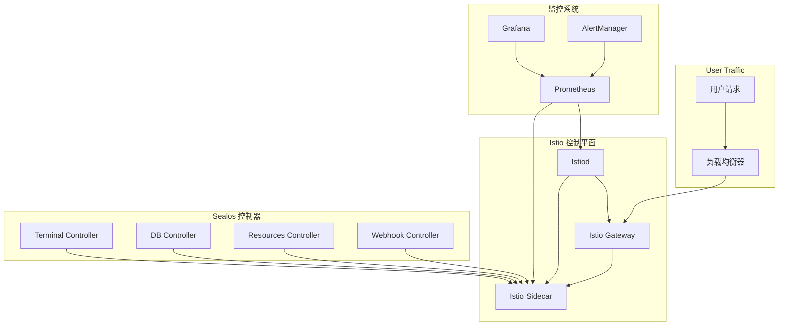

# Sealos Istio 迁移运维指南

## 概述

本指南面向 Sealos 运维人员和 SRE 团队，详细说明 Istio 迁移后的运维管理、故障排查、性能调优和日常维护工作。

## 架构概览

### 系统组件



### 关键配置位置

| 组件 | 配置位置 | 说明 |
|------|----------|------|
| Istio Gateway | `istio-system` namespace | 入口网关配置 |
| 控制器配置 | `sealos-system` namespace | 双模式配置 |
| 监控配置 | `monitoring` namespace | Prometheus/Grafana |
| 证书管理 | `cert-manager` namespace | 自动证书签发 |

## 日常运维操作

### 1. 系统状态检查

#### 快速健康检查脚本
```bash
#!/bin/bash
# health-check.sh - 系统健康检查脚本

echo "=== Sealos Istio 系统健康检查 ==="

# 检查 Istio 控制平面
echo "1. 检查 Istio 控制平面..."
kubectl get pods -n istio-system -o wide

# 检查 Gateway 状态
echo -e "\n2. 检查 Gateway 状态..."
kubectl get gateway --all-namespaces

# 检查 VirtualService 状态
echo -e "\n3. 检查 VirtualService 状态..."
kubectl get virtualservice --all-namespaces

# 检查控制器状态
echo -e "\n4. 检查 Sealos 控制器状态..."
kubectl get deployment -n sealos-system

# 检查证书状态
echo -e "\n5. 检查证书状态..."
kubectl get certificate --all-namespaces

# 检查监控状态
echo -e "\n6. 检查监控系统状态..."
kubectl get pods -n monitoring

echo -e "\n=== 健康检查完成 ==="
```

#### 自动化监控脚本
```bash
#!/bin/bash
# auto-monitor.sh - 自动化监控检查

PROMETHEUS_URL="http://prometheus.monitoring.svc.cluster.local:9090"
SLACK_WEBHOOK=${SLACK_WEBHOOK_URL}

check_error_rate() {
    local threshold=0.05
    local query="sum(rate(istio_requests_total{response_code=~'5.*'}[5m])) / sum(rate(istio_requests_total[5m]))"
    
    local result=$(curl -s "${PROMETHEUS_URL}/api/v1/query?query=${query}" | jq -r '.data.result[0].value[1] // "0"')
    
    if (( $(echo "$result > $threshold" | bc -l) )); then
        send_alert "高错误率告警" "当前错误率: ${result}, 阈值: ${threshold}"
        return 1
    fi
    
    echo "错误率正常: ${result}"
    return 0
}

check_latency() {
    local threshold=500
    local query="histogram_quantile(0.95, sum(rate(istio_request_duration_milliseconds_bucket[5m])) by (le))"
    
    local result=$(curl -s "${PROMETHEUS_URL}/api/v1/query?query=${query}" | jq -r '.data.result[0].value[1] // "0"')
    
    if (( $(echo "$result > $threshold" | bc -l) )); then
        send_alert "高延迟告警" "当前 P95 延迟: ${result}ms, 阈值: ${threshold}ms"
        return 1
    fi
    
    echo "延迟正常: ${result}ms"
    return 0
}

send_alert() {
    local title="$1"
    local message="$2"
    
    if [[ -n "$SLACK_WEBHOOK" ]]; then
        curl -X POST -H 'Content-type: application/json' \
            --data "{\"text\":\":warning: $title\\n$message\"}" \
            "$SLACK_WEBHOOK"
    fi
    
    # 记录到系统日志
    logger -t "sealos-monitor" "$title: $message"
}

main() {
    echo "$(date): 开始自动监控检查"
    
    check_error_rate
    check_latency
    
    echo "$(date): 监控检查完成"
}

# 每5分钟执行一次
while true; do
    main
    sleep 300
done
```

### 2. 配置管理

#### 灰度发布控制
```bash
#!/bin/bash
# rollout-control.sh - 灰度发布控制脚本

show_current_status() {
    echo "=== 当前 Istio 流量分布 ==="
    
    for controller in terminal-controller db-adminer-controller resources-controller; do
        local mode=$(kubectl get deployment $controller -n sealos-system -o jsonpath='{.spec.template.spec.containers[0].env[?(@.name=="NETWORKING_MODE")].value}' 2>/dev/null || echo "unknown")
        local percentage=$(kubectl get deployment $controller -n sealos-system -o jsonpath='{.spec.template.spec.containers[0].env[?(@.name=="ISTIO_PERCENTAGE")].value}' 2>/dev/null || echo "0")
        
        echo "$controller: $mode 模式, Istio 流量 $percentage%"
    done
}

update_traffic_split() {
    local component="$1"
    local percentage="$2"
    
    echo "更新 $component 的 Istio 流量比例到 $percentage%"
    
    local mode="dual"
    if [[ "$percentage" == "0" ]]; then
        mode="ingress"
    elif [[ "$percentage" == "100" ]]; then
        mode="istio"
    fi
    
    kubectl patch deployment "$component" -n sealos-system --type='merge' -p="{
        \"spec\": {
            \"template\": {
                \"spec\": {
                    \"containers\": [{
                        \"name\": \"controller\",
                        \"env\": [
                            {\"name\": \"NETWORKING_MODE\", \"value\": \"$mode\"},
                            {\"name\": \"ISTIO_PERCENTAGE\", \"value\": \"$percentage\"}
                        ]
                    }]
                }
            }
        }
    }"
    
    kubectl rollout status deployment/"$component" -n sealos-system --timeout=300s
}

case "$1" in
    "status")
        show_current_status
        ;;
    "update")
        update_traffic_split "$2" "$3"
        ;;
    *)
        echo "用法: $0 {status|update} [component] [percentage]"
        echo "示例: $0 update terminal-controller 50"
        ;;
esac
```

#### 证书管理
```bash
#!/bin/bash
# cert-management.sh - 证书管理脚本

check_cert_expiry() {
    echo "=== 检查证书到期时间 ==="
    
    kubectl get certificate --all-namespaces -o custom-columns=\
"NAMESPACE:.metadata.namespace,NAME:.metadata.name,READY:.status.conditions[0].status,AGE:.metadata.creationTimestamp"
}

renew_certificates() {
    echo "=== 强制证书续期 ==="
    
    # 删除证书，触发自动续期
    kubectl get certificate --all-namespaces -o json | \
        jq -r '.items[] | select(.status.conditions[0].status != "True") | "\(.metadata.namespace) \(.metadata.name)"' | \
        while read namespace name; do
            echo "续期证书: $namespace/$name"
            kubectl delete certificate "$name" -n "$namespace"
        done
}

backup_certificates() {
    local backup_dir="/backup/certificates/$(date +%Y%m%d)"
    mkdir -p "$backup_dir"
    
    echo "=== 备份证书到 $backup_dir ==="
    
    kubectl get certificate --all-namespaces -o yaml > "$backup_dir/certificates.yaml"
    kubectl get secret --all-namespaces -l cert-manager.io/certificate-name -o yaml > "$backup_dir/cert-secrets.yaml"
    
    echo "证书备份完成"
}

case "$1" in
    "check")
        check_cert_expiry
        ;;
    "renew")
        renew_certificates
        ;;
    "backup")
        backup_certificates
        ;;
    *)
        echo "用法: $0 {check|renew|backup}"
        ;;
esac
```

### 3. 性能调优

#### Istio 配置优化
```yaml
# istio-performance-config.yaml
apiVersion: v1
kind: ConfigMap
metadata:
  name: istio-performance
  namespace: istio-system
data:
  mesh: |
    defaultConfig:
      # 连接池设置
      proxyStatsMatcher:
        inclusion_regexps:
        - ".*circuit_breakers.*"
        - ".*upstream_rq_retry.*"
        - ".*upstream_rq_pending.*"
        - ".*_cx_.*"
      # 内存优化
      concurrency: 2
      # CPU 优化
      proxyMetadata:
        PILOT_ENABLE_WORKLOAD_ENTRY_AUTOREGISTRATION: true
        BOOTSTRAP_XDS_AGENT: true
    extensionProviders:
    - name: prometheus
      prometheus:
        configOverride:
          metric_relabeling_configs:
          - source_labels: [__name__]
            regex: 'istio_request_duration_milliseconds_bucket'
            target_label: __tmp_duration_bucket
---
apiVersion: v1
kind: ConfigMap
metadata:
  name: istio-proxy-config
  namespace: istio-system  
data:
  ProxyConfig: |
    # 连接设置
    connectionTimeout: 10s
    # 统计设置
    statsConfig:
      disable_host_header_fallback: true
    # 追踪设置
    tracing:
      sampling: 1.0  # 生产环境建议 0.1
```

#### 资源限制配置
```yaml
# istio-resource-limits.yaml
apiVersion: v1
kind: ConfigMap
metadata:
  name: istio-sidecar-injector
  namespace: istio-system
data:
  config: |
    policy: enabled
    alwaysInjectSelector:
      []
    neverInjectSelector:
      []
    template: |
      spec:
        containers:
        - name: istio-proxy
          resources:
            limits:
              cpu: 200m
              memory: 256Mi
            requests:
              cpu: 50m
              memory: 128Mi
```

### 4. 故障排查

#### 常见问题诊断脚本
```bash
#!/bin/bash
# troubleshoot.sh - 故障诊断脚本

diagnose_connectivity() {
    local app_name="$1"
    local namespace="${2:-default}"
    
    echo "=== 诊断应用连接问题: $app_name ==="
    
    # 检查 Pod 状态
    echo "1. 检查 Pod 状态:"
    kubectl get pods -l app="$app_name" -n "$namespace" -o wide
    
    # 检查 Service
    echo -e "\n2. 检查 Service:"
    kubectl get svc -l app="$app_name" -n "$namespace"
    
    # 检查 Gateway
    echo -e "\n3. 检查 Gateway:"
    kubectl get gateway -n "$namespace"
    
    # 检查 VirtualService
    echo -e "\n4. 检查 VirtualService:"
    kubectl get virtualservice -n "$namespace"
    
    # 检查 Istio 配置同步
    echo -e "\n5. 检查 Istio 配置同步:"
    local pod=$(kubectl get pods -l app="$app_name" -n "$namespace" -o jsonpath='{.items[0].metadata.name}')
    if [[ -n "$pod" ]]; then
        istioctl proxy-config cluster "$pod" -n "$namespace"
    fi
    
    # 检查证书
    echo -e "\n6. 检查证书状态:"
    kubectl get certificate -n "$namespace"
}

diagnose_performance() {
    echo "=== 性能诊断 ==="
    
    # 检查 Istio Proxy 资源使用
    echo "1. Istio Proxy 资源使用:"
    kubectl top pods --all-namespaces --containers | grep istio-proxy
    
    # 检查控制平面资源使用
    echo -e "\n2. Istio 控制平面资源使用:"
    kubectl top pods -n istio-system
    
    # 检查近期错误日志
    echo -e "\n3. 检查近期错误日志:"
    kubectl logs -n istio-system deployment/istiod --since=10m | grep -i error
}

diagnose_certificates() {
    echo "=== 证书诊断 ==="
    
    # 检查证书状态
    kubectl get certificate --all-namespaces | grep -v True
    
    # 检查 cert-manager 日志
    echo -e "\n检查 cert-manager 日志:"
    kubectl logs -n cert-manager deployment/cert-manager --since=10m | grep -i error
}

case "$1" in
    "connectivity")
        diagnose_connectivity "$2" "$3"
        ;;
    "performance")
        diagnose_performance
        ;;
    "certificates")
        diagnose_certificates
        ;;
    *)
        echo "用法: $0 {connectivity|performance|certificates} [app_name] [namespace]"
        ;;
esac
```

#### 紧急故障处理流程

```bash
#!/bin/bash
# emergency-response.sh - 紧急故障响应脚本

declare -A RUNBOOKS=(
    ["high_error_rate"]="高错误率处理"
    ["service_down"]="服务宕机处理"
    ["certificate_expired"]="证书过期处理"
    ["memory_leak"]="内存泄漏处理"
)

handle_high_error_rate() {
    echo "=== 处理高错误率问题 ==="
    
    # 1. 立即降级到 Ingress
    echo "1. 紧急降级到 Ingress 模式..."
    ./emergency-rollback.sh --mode ingress --reason "High error rate detected"
    
    # 2. 收集诊断信息
    echo "2. 收集诊断信息..."
    kubectl logs -n istio-system deployment/istiod --since=15m > /tmp/istiod-errors.log
    kubectl get events --all-namespaces --since=15m > /tmp/cluster-events.log
    
    # 3. 通知相关团队
    echo "3. 发送告警通知..."
    send_emergency_alert "高错误率告警" "已执行紧急降级，需要立即介入处理"
}

handle_service_down() {
    echo "=== 处理服务宕机问题 ==="
    
    # 1. 检查控制器状态
    echo "1. 检查控制器状态..."
    kubectl get deployment -n sealos-system
    
    # 2. 重启异常控制器
    echo "2. 重启异常控制器..."
    for controller in terminal-controller db-adminer-controller resources-controller; do
        local ready=$(kubectl get deployment "$controller" -n sealos-system -o jsonpath='{.status.readyReplicas}')
        local desired=$(kubectl get deployment "$controller" -n sealos-system -o jsonpath='{.spec.replicas}')
        
        if [[ "$ready" != "$desired" ]]; then
            echo "重启控制器: $controller"
            kubectl rollout restart deployment/"$controller" -n sealos-system
        fi
    done
    
    # 3. 验证恢复
    echo "3. 验证服务恢复..."
    sleep 30
    kubectl get deployment -n sealos-system
}

handle_certificate_expired() {
    echo "=== 处理证书过期问题 ==="
    
    # 1. 检查过期证书
    echo "1. 检查过期证书..."
    kubectl get certificate --all-namespaces -o json | \
        jq -r '.items[] | select(.status.conditions[0].status != "True") | "\(.metadata.namespace)/\(.metadata.name)"'
    
    # 2. 强制续期
    echo "2. 强制证书续期..."
    kubectl delete certificate --all-namespaces -l cert-manager.io/certificate-name
    
    # 3. 等待自动签发
    echo "3. 等待证书自动签发..."
    sleep 60
    kubectl get certificate --all-namespaces
}

handle_memory_leak() {
    echo "=== 处理内存泄漏问题 ==="
    
    # 1. 识别高内存使用的 Pod
    echo "1. 识别高内存使用的 Pod..."
    kubectl top pods --all-namespaces --sort-by=memory | head -20
    
    # 2. 重启 Istio 代理
    echo "2. 重启高内存使用的 Istio 代理..."
    kubectl get pods --all-namespaces -o json | \
        jq -r '.items[] | select(.spec.containers[]?.name == "istio-proxy") | "\(.metadata.namespace) \(.metadata.name)"' | \
        while read namespace pod; do
            local memory=$(kubectl top pod "$pod" -n "$namespace" --no-headers | awk '{print $3}' | sed 's/Mi//')
            if [[ "$memory" -gt 256 ]]; then
                echo "重启高内存 Pod: $namespace/$pod (${memory}Mi)"
                kubectl delete pod "$pod" -n "$namespace"
            fi
        done
}

send_emergency_alert() {
    local title="$1"
    local message="$2"
    
    # 发送到 Slack
    if [[ -n "${SLACK_WEBHOOK_URL:-}" ]]; then
        curl -X POST -H 'Content-type: application/json' \
            --data "{\"text\":\":rotating_light: $title\\n$message\"}" \
            "$SLACK_WEBHOOK_URL"
    fi
    
    # 记录到审计日志
    echo "$(date -Iseconds): EMERGENCY - $title: $message" >> /var/log/sealos-emergency.log
}

show_runbooks() {
    echo "=== 可用的应急预案 ==="
    for key in "${!RUNBOOKS[@]}"; do
        echo "$key: ${RUNBOOKS[$key]}"
    done
}

case "$1" in
    "high_error_rate")
        handle_high_error_rate
        ;;
    "service_down")
        handle_service_down
        ;;
    "certificate_expired")
        handle_certificate_expired
        ;;
    "memory_leak")
        handle_memory_leak
        ;;
    "list")
        show_runbooks
        ;;
    *)
        echo "用法: $0 {high_error_rate|service_down|certificate_expired|memory_leak|list}"
        show_runbooks
        ;;
esac
```

## 监控和告警

### 关键指标监控

#### Prometheus 规则配置
```yaml
# sealos-istio-alerts.yml
groups:
- name: sealos-istio-critical
  rules:
  - alert: SealosIstioHighErrorRate
    expr: |
      (
        sum(rate(istio_requests_total{destination_service_namespace="sealos-system",response_code=~"5.*"}[5m])) /
        sum(rate(istio_requests_total{destination_service_namespace="sealos-system"}[5m]))
      ) > 0.05
    for: 2m
    labels:
      severity: critical
      team: sre
    annotations:
      summary: "Sealos Istio 服务高错误率"
      description: "Sealos 系统 Istio 服务错误率 {{ $value | humanizePercentage }} 超过 5%"
      runbook_url: "https://docs.sealos.io/runbooks/istio-high-error-rate"

  - alert: SealosControllerDown
    expr: |
      up{job=~".*controller.*", namespace="sealos-system"} == 0
    for: 1m
    labels:
      severity: critical
      team: sre
    annotations:
      summary: "Sealos 控制器服务宕机"
      description: "控制器 {{ $labels.job }} 已宕机超过 1 分钟"
      
  - alert: SealosIstioGatewayDown
    expr: |
      up{job="istio-proxy", namespace="istio-system"} == 0
    for: 1m
    labels:
      severity: critical
      team: sre
    annotations:
      summary: "Istio Gateway 宕机"
      description: "Istio Gateway 服务不可用"

- name: sealos-istio-warning
  rules:
  - alert: SealosIstioHighLatency
    expr: |
      histogram_quantile(0.95,
        sum(rate(istio_request_duration_milliseconds_bucket{destination_service_namespace="sealos-system"}[5m]))
        by (destination_service_name, le)
      ) > 1000
    for: 5m
    labels:
      severity: warning
      team: sre
    annotations:
      summary: "Sealos Istio 服务高延迟"
      description: "服务 {{ $labels.destination_service_name }} P95 延迟 {{ $value }}ms 超过 1 秒"

  - alert: SealosIstioProxyHighMemory
    expr: |
      container_memory_working_set_bytes{container="istio-proxy", namespace="sealos-system"} /
      container_spec_memory_limit_bytes{container="istio-proxy", namespace="sealos-system"} > 0.8
    for: 5m
    labels:
      severity: warning
      team: sre
    annotations:
      summary: "Istio Proxy 内存使用过高"
      description: "Pod {{ $labels.pod }} Istio Proxy 内存使用率 {{ $value | humanizePercentage }}"
```

### 日志聚合配置

#### Fluent Bit 配置
```yaml
# fluent-bit-istio.conf
[SERVICE]
    Flush         1
    Log_Level     info
    Daemon        off
    Parsers_File  parsers.conf

[INPUT]
    Name              tail
    Path              /var/log/containers/*istio-proxy*.log
    Parser            docker
    Tag               istio.proxy.*
    Refresh_Interval  5
    Mem_Buf_Limit     50MB

[INPUT]
    Name              tail
    Path              /var/log/containers/*istiod*.log
    Parser            docker
    Tag               istio.control.*
    Refresh_Interval  5

[FILTER]
    Name                parser
    Match               istio.proxy.*
    Key_Name            log
    Parser              istio_access_log
    Reserve_Data        True

[OUTPUT]
    Name  es
    Match istio.*
    Host  elasticsearch.monitoring.svc.cluster.local
    Port  9200
    Index istio-logs
    Type  _doc
```

### 性能基准测试

#### 自动化性能测试脚本
```bash
#!/bin/bash
# performance-test.sh - 性能基准测试

ISTIO_GATEWAY_URL="http://istio-ingressgateway.istio-system.svc.cluster.local"
TEST_DURATION="60s"
CONCURRENT_USERS=(1 10 50 100)

run_load_test() {
    local users="$1"
    local target_url="$2"
    local test_name="$3"
    
    echo "=== 运行性能测试: $test_name (并发用户: $users) ==="
    
    # 使用 hey 进行负载测试
    local result=$(hey -n 1000 -c "$users" -t 30 "$target_url" 2>/dev/null)
    
    # 解析结果
    local p95_latency=$(echo "$result" | grep "95%" | awk '{print $2}')
    local success_rate=$(echo "$result" | grep "Status code distribution" -A 5 | grep "200" | awk '{print $3}' | tr -d '[]')
    local rps=$(echo "$result" | grep "Requests/sec" | awk '{print $2}')
    
    # 记录结果
    echo "P95 延迟: $p95_latency"
    echo "成功率: $success_rate"
    echo "RPS: $rps"
    
    # 保存到文件
    echo "$(date -Iseconds),$test_name,$users,$p95_latency,$success_rate,$rps" >> /tmp/performance-results.csv
}

benchmark_all_services() {
    echo "开始 Sealos Istio 性能基准测试..."
    
    # 创建结果文件
    echo "timestamp,service,concurrent_users,p95_latency,success_rate,rps" > /tmp/performance-results.csv
    
    # 测试各个服务
    local services=(
        "terminal-test.cloud.sealos.io"
        "dbadmin-test.cloud.sealos.io"
        "app-test.cloud.sealos.io"
    )
    
    for service in "${services[@]}"; do
        for users in "${CONCURRENT_USERS[@]}"; do
            run_load_test "$users" "http://$service/" "$service"
            sleep 10  # 测试间隔
        done
    done
    
    echo "性能测试完成，结果保存在 /tmp/performance-results.csv"
}

compare_with_baseline() {
    local baseline_file="$1"
    local current_file="/tmp/performance-results.csv"
    
    echo "=== 与基准性能对比 ==="
    
    # 这里可以添加复杂的对比逻辑
    # 简单示例：检查延迟是否超过基准 20%
    
    echo "基准文件: $baseline_file"
    echo "当前文件: $current_file"
    echo "详细对比分析请查看 Grafana 性能仪表板"
}

case "$1" in
    "run")
        benchmark_all_services
        ;;
    "compare")
        compare_with_baseline "$2"
        ;;
    *)
        echo "用法: $0 {run|compare} [baseline_file]"
        ;;
esac
```

## 备份和恢复

### 配置备份脚本
```bash
#!/bin/bash
# backup-config.sh - 配置备份脚本

BACKUP_DIR="/backup/sealos-istio/$(date +%Y%m%d)"
S3_BUCKET="sealos-backups"

backup_istio_config() {
    echo "=== 备份 Istio 配置 ==="
    
    mkdir -p "$BACKUP_DIR/istio"
    
    # 备份 Istio 控制平面配置
    kubectl get configmap -n istio-system -o yaml > "$BACKUP_DIR/istio/configmaps.yaml"
    kubectl get secret -n istio-system -o yaml > "$BACKUP_DIR/istio/secrets.yaml"
    
    # 备份 Gateway 和 VirtualService
    kubectl get gateway --all-namespaces -o yaml > "$BACKUP_DIR/istio/gateways.yaml"
    kubectl get virtualservice --all-namespaces -o yaml > "$BACKUP_DIR/istio/virtualservices.yaml"
    kubectl get destinationrule --all-namespaces -o yaml > "$BACKUP_DIR/istio/destinationrules.yaml"
    
    echo "Istio 配置备份完成: $BACKUP_DIR/istio/"
}

backup_sealos_config() {
    echo "=== 备份 Sealos 控制器配置 ==="
    
    mkdir -p "$BACKUP_DIR/sealos"
    
    # 备份控制器部署配置
    kubectl get deployment -n sealos-system -o yaml > "$BACKUP_DIR/sealos/deployments.yaml"
    kubectl get configmap -n sealos-system -o yaml > "$BACKUP_DIR/sealos/configmaps.yaml"
    kubectl get secret -n sealos-system -o yaml > "$BACKUP_DIR/sealos/secrets.yaml"
    
    echo "Sealos 配置备份完成: $BACKUP_DIR/sealos/"
}

backup_certificates() {
    echo "=== 备份证书配置 ==="
    
    mkdir -p "$BACKUP_DIR/certificates"
    
    kubectl get certificate --all-namespaces -o yaml > "$BACKUP_DIR/certificates/certificates.yaml"
    kubectl get certificateissuer --all-namespaces -o yaml > "$BACKUP_DIR/certificates/issuers.yaml"
    kubectl get secret --all-namespaces -l cert-manager.io/certificate-name -o yaml > "$BACKUP_DIR/certificates/cert-secrets.yaml"
    
    echo "证书配置备份完成: $BACKUP_DIR/certificates/"
}

upload_to_s3() {
    if command -v aws >/dev/null 2>&1; then
        echo "=== 上传备份到 S3 ==="
        
        tar -czf "$BACKUP_DIR.tar.gz" -C "$(dirname "$BACKUP_DIR")" "$(basename "$BACKUP_DIR")"
        aws s3 cp "$BACKUP_DIR.tar.gz" "s3://$S3_BUCKET/sealos-istio/"
        
        echo "备份已上传到 S3: s3://$S3_BUCKET/sealos-istio/"
    else
        echo "AWS CLI 未安装，跳过 S3 上传"
    fi
}

main() {
    echo "开始 Sealos Istio 配置备份..."
    
    backup_istio_config
    backup_sealos_config  
    backup_certificates
    upload_to_s3
    
    echo "备份完成: $BACKUP_DIR"
}

main "$@"
```

## 安全管理

### 访问控制配置
```yaml
# security-policies.yaml
apiVersion: security.istio.io/v1beta1
kind: AuthorizationPolicy
metadata:
  name: sealos-system-access
  namespace: sealos-system
spec:
  rules:
  - from:
    - source:
        principals: ["cluster.local/ns/istio-system/sa/istio-ingressgateway-service-account"]
  - to:
    - operation:
        methods: ["GET", "POST", "PUT", "DELETE"]
---
apiVersion: security.istio.io/v1beta1
kind: PeerAuthentication
metadata:
  name: sealos-mtls
  namespace: sealos-system
spec:
  mtls:
    mode: STRICT
```

### 网络策略
```yaml
# network-policies.yaml
apiVersion: networking.k8s.io/v1
kind: NetworkPolicy
metadata:
  name: sealos-system-isolation
  namespace: sealos-system
spec:
  podSelector: {}
  policyTypes:
  - Ingress
  - Egress
  ingress:
  - from:
    - namespaceSelector:
        matchLabels:
          name: istio-system
  - from:
    - podSelector: {}
  egress:
  - to:
    - namespaceSelector:
        matchLabels:
          name: kube-system
  - to:
    - namespaceSelector:
        matchLabels:
          name: istio-system
```

## 总结

本运维指南提供了 Sealos Istio 迁移后的完整运维管理方案，包括：

1. **日常运维操作** - 健康检查、配置管理、性能调优
2. **故障排查** - 诊断脚本、应急响应流程
3. **监控告警** - 关键指标监控、自动化告警
4. **备份恢复** - 配置备份、灾难恢复
5. **安全管理** - 访问控制、网络安全策略

通过这些运维工具和流程，可以确保 Sealos Istio 系统的稳定运行和高可用性。