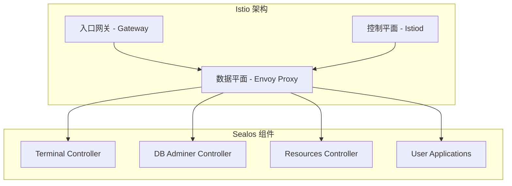

# Sealos Istio 迁移团队培训材料

## 培训概述

本培训材料面向 Sealos 团队成员，包括开发人员、运维人员和 SRE 团队，旨在确保团队能够熟练掌握 Istio 迁移后的系统操作、故障排查和日常维护。

## 培训对象与目标

### 开发团队 (Dev Team)
**培训目标：**
- 理解 Istio 架构和基本概念
- 掌握应用部署的变化和新特性
- 学会本地开发和调试技巧

### 运维团队 (Ops Team)
**培训目标：**
- 掌握 Istio 系统的日常运维操作
- 学会监控、告警和性能调优
- 熟练使用故障排查工具和流程

### SRE 团队
**培训目标：**
- 深入理解 Istio 架构和原理
- 掌握高级故障排查和应急响应
- 能够进行系统优化和容量规划

## 培训课程安排

### 第一部分：基础理论 (2小时)

#### 1.1 Istio 架构概述 (30分钟)

**核心概念：**


**关键要点：**
- **数据平面**：Envoy 代理处理所有服务间通信
- **控制平面**：Istiod 管理配置和证书
- **网关**：统一的入口点替代多个 Ingress

**与 Ingress 的对比：**
| 特性 | Ingress | Istio |
|------|---------|-------|
| 路由能力 | 基础 HTTP/HTTPS | 高级路由、协议支持 |
| 负载均衡 | 简单轮询 | 多种算法、健康检查 |
| 安全性 | TLS 终止 | mTLS、细粒度授权 |
| 监控 | 基础指标 | 全面可观测性 |

#### 1.2 迁移策略和双模式原理 (30分钟)

**双模式设计：**
```yaml
# 控制器环境变量
NETWORKING_MODE: "dual"        # ingress/dual/istio
ISTIO_PERCENTAGE: "25"         # 0-100
ENABLE_ISTIO_MONITORING: "true"
```

**流量分配逻辑：**
```go
func (r *TerminalReconciler) routeTraffic(percentage int) {
    if percentage == 0 {
        // 100% Ingress
        r.createIngress()
    } else if percentage == 100 {
        // 100% Istio
        r.createIstioConfig()
    } else {
        // 混合模式
        r.createBothConfigs()
        r.setupTrafficSplit(percentage)
    }
}
```

#### 1.3 安全模型变化 (30分钟)

**Istio 安全增强：**
- **mTLS 自动加密**：服务间通信自动加密
- **授权策略**：细粒度的访问控制
- **证书管理**：自动证书轮换

**配置示例：**
```yaml
# 启用严格 mTLS
apiVersion: security.istio.io/v1beta1
kind: PeerAuthentication
metadata:
  name: sealos-mtls
  namespace: sealos-system
spec:
  mtls:
    mode: STRICT
```

#### 1.4 监控和可观测性 (30分钟)

**新增监控能力：**
- **分布式追踪**：请求在服务间的完整链路
- **服务拓扑**：实时的服务依赖关系图
- **细粒度指标**：请求级别的性能数据

### 第二部分：实操训练 (3小时)

#### 2.1 开发者实操 (1小时)

**场景1：本地开发环境配置**
```bash
# 1. 配置端口转发
kubectl port-forward svc/istio-ingressgateway 8080:80 -n istio-system

# 2. 配置本地 hosts
echo "127.0.0.1 myapp-local.cloud.sealos.io" >> /etc/hosts

# 3. 测试应用
curl -H "Host: myapp-local.cloud.sealos.io" http://localhost:8080/
```

**场景2：应用部署调试**
```bash
# 1. 检查 Gateway 配置
kubectl get gateway -n my-namespace -o yaml

# 2. 检查 VirtualService 配置
kubectl get virtualservice -n my-namespace -o yaml

# 3. 验证路由配置
istioctl proxy-config route deployment/my-app
```

**场景3：故障诊断**
```bash
# 1. 查看应用日志
kubectl logs deployment/my-app -c istio-proxy

# 2. 检查配置同步
istioctl proxy-status

# 3. 分析访问日志
kubectl logs -l app=istio-ingressgateway -n istio-system
```

#### 2.2 运维人员实操 (1小时)

**场景1：日常健康检查**
```bash
# 使用提供的健康检查脚本
./scripts/istio-migration/health-check.sh

# 检查关键指标
kubectl top pods -n istio-system
kubectl get pods -n sealos-system
```

**场景2：流量切换操作**
```bash
# 查看当前状态
./scripts/istio-migration/gradual-rollout.sh

# 切换 Terminal 组件到 50% Istio
./scripts/istio-migration/gradual-rollout.sh \
    --component terminal --percentage 50

# 全体组件切换到 25% Istio
./scripts/istio-migration/gradual-rollout.sh \
    --all-components --percentage 25
```

**场景3：监控面板使用**
```bash
# 访问 Grafana
kubectl port-forward svc/grafana 3000:80 -n monitoring

# 访问 Kiali (服务拓扑)
kubectl port-forward svc/kiali 20001:20001 -n istio-system

# 访问 Jaeger (链路追踪)
istioctl dashboard jaeger
```

#### 2.3 SRE 高级实操 (1小时)

**场景1：性能调优**
```yaml
# 调整 Istio Proxy 资源限制
apiVersion: v1
kind: ConfigMap
metadata:
  name: istio-sidecar-injector
  namespace: istio-system
data:
  config: |
    template: |
      spec:
        containers:
        - name: istio-proxy
          resources:
            limits:
              cpu: 200m
              memory: 256Mi
            requests:
              cpu: 50m
              memory: 128Mi
```

**场景2：应急响应**
```bash
# 紧急回滚到 Ingress
./scripts/istio-migration/emergency-rollback.sh \
    --reason "High error rate detected" --force

# 部分回滚保持 10% Istio
./scripts/istio-migration/emergency-rollback.sh \
    --mode dual --percentage 10 \
    --reason "Performance issue"
```

**场景3：故障分析**
```bash
# 深度故障诊断
./scripts/istio-migration/troubleshoot.sh connectivity terminal

# 性能问题分析
./scripts/istio-migration/troubleshoot.sh performance

# 证书问题检查
./scripts/istio-migration/troubleshoot.sh certificates
```

### 第三部分：故障排查专题 (2小时)

#### 3.1 常见问题和解决方案 (1小时)

**问题1：应用无法访问**
```bash
# 诊断步骤
1. 检查 Pod 状态
kubectl get pods -l app=my-app -o wide

2. 检查 Service 配置
kubectl get svc -l app=my-app

3. 检查 Gateway 状态
kubectl describe gateway my-gateway

4. 检查 VirtualService 配置
kubectl describe virtualservice my-vs

5. 验证 Istio 配置同步
istioctl proxy-status
```

**问题2：高延迟问题**
```bash
# 分析步骤
1. 查看延迟指标
curl -s "http://prometheus:9090/api/v1/query?query=histogram_quantile(0.95, istio_request_duration_milliseconds_bucket)"

2. 检查资源使用
kubectl top pods --containers | grep istio-proxy

3. 分析追踪数据
istioctl dashboard jaeger

4. 优化配置
# 调整连接池和超时设置
```

**问题3：证书相关问题**
```bash
# 检查步骤
1. 验证证书状态
kubectl get certificate --all-namespaces

2. 检查 cert-manager 日志
kubectl logs -n cert-manager deployment/cert-manager

3. 手动验证证书
openssl s_client -connect app.sealos.io:443 -servername app.sealos.io

4. 强制证书续期
kubectl delete certificate my-cert
```

#### 3.2 高级故障排查技巧 (1小时)

**技巧1：使用 istioctl 诊断**
```bash
# 检查代理配置
istioctl proxy-config cluster my-pod

# 分析路由配置
istioctl proxy-config route my-pod --name 80

# 检查监听器配置
istioctl proxy-config listener my-pod

# 验证配置同步
istioctl proxy-status my-pod
```

**技巧2：日志分析技巧**
```bash
# Envoy 访问日志格式
kubectl logs my-pod -c istio-proxy | grep "GET /api"

# 结构化日志查询
kubectl logs my-pod -c istio-proxy --since=10m | jq '.response_code'

# 错误日志聚合
kubectl logs -l app=my-app -c istio-proxy | grep "error" | sort | uniq -c
```

**技巧3：网络调试**
```bash
# 使用 debug 容器
kubectl debug my-pod -it --image=nicolaka/netshoot

# 在 debug 容器中测试连接
curl -v http://my-service:8080/health

# 检查 DNS 解析
nslookup my-service.my-namespace.svc.cluster.local
```

### 第四部分：最佳实践和案例研究 (1小时)

#### 4.1 部署最佳实践 (30分钟)

**实践1：应用健康检查**
```yaml
apiVersion: v1
kind: Service
metadata:
  name: my-app
  annotations:
    prometheus.io/scrape: "true"
    prometheus.io/port: "8080"
    prometheus.io/path: "/metrics"
spec:
  ports:
  - port: 8080
    name: http-monitoring
```

**实践2：超时和重试配置**
```yaml
apiVersion: networking.istio.io/v1beta1
kind: VirtualService
metadata:
  name: my-app-vs
spec:
  http:
  - route:
    - destination:
        host: my-app
    timeout: 30s
    retries:
      attempts: 3
      perTryTimeout: 10s
```

**实践3：熔断保护**
```yaml
apiVersion: networking.istio.io/v1beta1
kind: DestinationRule
metadata:
  name: my-app-circuit-breaker
spec:
  host: my-app
  trafficPolicy:
    outlierDetection:
      consecutiveErrors: 3
      interval: 30s
      baseEjectionTime: 30s
```

#### 4.2 案例研究 (30分钟)

**案例1：Terminal 服务迁移**
```yaml
# 迁移前配置 (Ingress)
apiVersion: networking.k8s.io/v1
kind: Ingress
metadata:
  name: terminal
  annotations:
    nginx.ingress.kubernetes.io/backend-protocol: "WS"
spec:
  rules:
  - host: terminal-abc.cloud.sealos.io
    http:
      paths:
      - path: /
        backend:
          service:
            name: terminal
            port:
              number: 8080
```

```yaml
# 迁移后配置 (Istio)
apiVersion: networking.istio.io/v1beta1
kind: VirtualService
metadata:
  name: terminal-vs
spec:
  hosts:
  - terminal-abc.cloud.sealos.io
  http:
  - match:
    - headers:
        upgrade:
          exact: websocket
    route:
    - destination:
        host: terminal
    timeout: 0s  # WebSocket 长连接
```

**迁移收益：**
- ✅ WebSocket 连接更稳定
- ✅ 自动故障恢复
- ✅ 详细的连接监控

**案例2：数据库管理服务优化**
```yaml
# 添加安全头和 CORS 策略
apiVersion: networking.istio.io/v1beta1
kind: VirtualService
metadata:
  name: db-admin-vs
spec:
  http:
  - route:
    - destination:
        host: db-admin
    headers:
      response:
        set:
          X-Frame-Options: "DENY"
          X-Content-Type-Options: "nosniff"
    corsPolicy:
      allowOrigins:
      - exact: "https://cloud.sealos.io"
      allowMethods:
      - GET
      - POST
```

## 培训评估和认证

### 理论考试 (30分钟)
**选择题示例：**

1. Istio 中负责配置管理的组件是？
   - A. Envoy
   - B. Istiod  ✓
   - C. Gateway
   - D. Pilot

2. 在双模式下，ISTIO_PERCENTAGE=30 表示：
   - A. 30% 流量走 Ingress
   - B. 30% 流量走 Istio  ✓
   - C. 30% 的应用启用 Istio
   - D. 30% 的功能使用 Istio

**简答题示例：**
1. 解释 mTLS 的作用和工作原理
2. 描述紧急回滚的触发条件和执行步骤
3. 列举三种 Istio 故障排查的常用工具

### 实操考试 (1小时)
**任务1：配置流量切换 (20分钟)**
- 将 Terminal 组件的 Istio 流量比例调整为 40%
- 验证配置是否生效
- 检查相关监控指标

**任务2：故障诊断 (20分钟)**
- 模拟应用访问失败
- 使用工具定位问题根因
- 提供解决方案

**任务3：应急响应 (20分钟)**
- 模拟高错误率场景
- 执行紧急回滚操作
- 验证系统恢复正常

### 认证等级

#### Bronze 级别 (基础操作员)
**要求：**
- 通过理论考试 (70分以上)
- 完成基础实操任务
- 能够执行日常运维操作

**权限：**
- 查看监控面板
- 执行健康检查脚本
- 进行基础故障排查

#### Silver 级别 (高级操作员)
**要求：**
- 通过理论考试 (85分以上)
- 完成高级实操任务
- 能够处理复杂故障

**权限：**
- 执行流量切换操作
- 进行性能调优
- 处理证书相关问题

#### Gold 级别 (专家级)
**要求：**
- 通过理论考试 (95分以上)
- 完成专家级实操任务
- 能够设计优化方案

**权限：**
- 执行紧急回滚操作
- 修改系统配置
- 制定运维策略

## 培训资源

### 在线资源
- 📚 [Istio 官方文档](https://istio.io/docs/)
- 🎥 [Sealos Istio 迁移培训视频](https://training.sealos.io/istio)
- 💻 [实验环境](https://lab.sealos.io/istio-migration)

### 工具和脚本
- `/scripts/istio-migration/` - 完整的管理脚本集
- `/docs/istio-migration/` - 详细的技术文档
- Grafana 监控面板配置
- 故障排查手册

### 持续学习
- 📅 每月技术分享会
- 🔄 季度最佳实践更新
- 🆘 7x24 技术支持频道

## 培训反馈

### 课程评估表
```
培训内容评分：
理论部分    ⭐⭐⭐⭐⭐
实操训练    ⭐⭐⭐⭐⭐
故障排查    ⭐⭐⭐⭐⭐
案例研究    ⭐⭐⭐⭐⭐

建议改进：
_________________________
_________________________

整体满意度：⭐⭐⭐⭐⭐
```

### 持续改进
- 根据反馈更新培训内容
- 增加新的案例研究
- 完善实操环境
- 优化认证流程

---

**培训联系人：**
- 📧 training@sealos.io
- 💬 Slack: #istio-training
- 📞 技术热线: 400-SEALOS

**培训完成后，所有参与者将获得 Sealos Istio Migration 官方认证证书！**